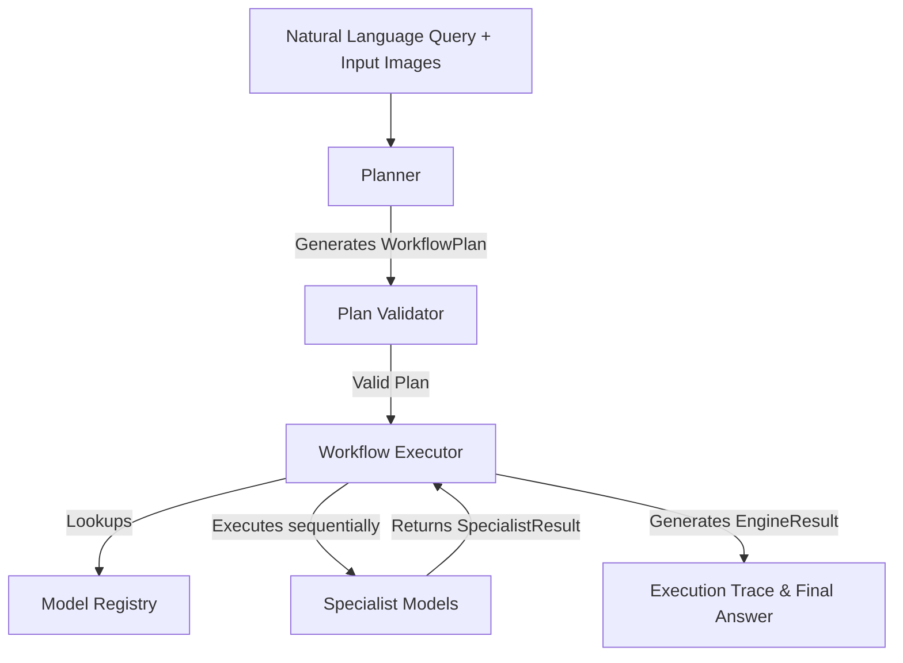

# SatQuery Architecture

SatQuery AI uses a model-agnostic, deterministic execution architecture.

## Request Flow

## Core Components
- **Planner**: A rule-based (future: LLM-based) component that maps natural language + inputs to a structured WorkflowPlan.
- **Plan Validator**: Verifies that the task matches the available inputs (e.g. Temporal tasks require 2 images).
- **Model Registry**: Centralized registry for all available Specialist models (VQA, Change Detection, Fusion, etc.).
- **Workflow Executor**: Deterministically executes the steps defined in the plan, collects evidence, and generates the final EngineResult.
- **Specialist Models**: Independent, modular AI components that implement the `SpecialistModel` interface.

## Cross-Modal AI Workflow

`	ext
                CROSS-MODAL QUERY
                       ↓
                Planner
                       ↓
              Pair Validator
                       ↓
                Registration
                       ↓
            ┌──────────┴──────────┐
            ▼                     ▼
         Optical                  SAR
       Preprocessor           Preprocessor
            │                     │
            └──────────┬──────────┘
                       ▼
              Cross-Modal AI
                       │
                       ▼
                   Evidence
                       │
                       ▼
                 EngineResult
`
