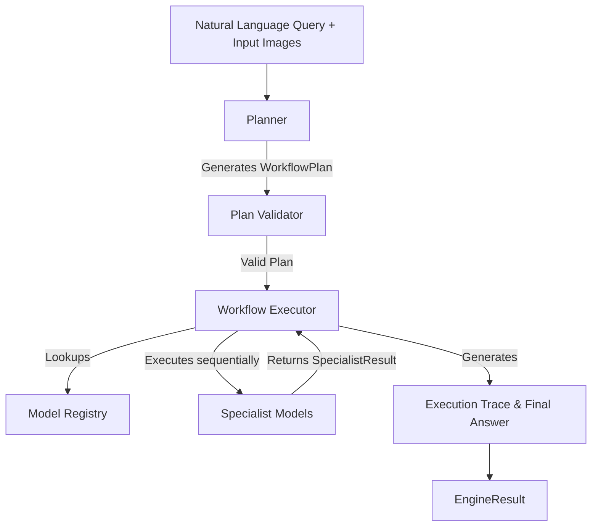
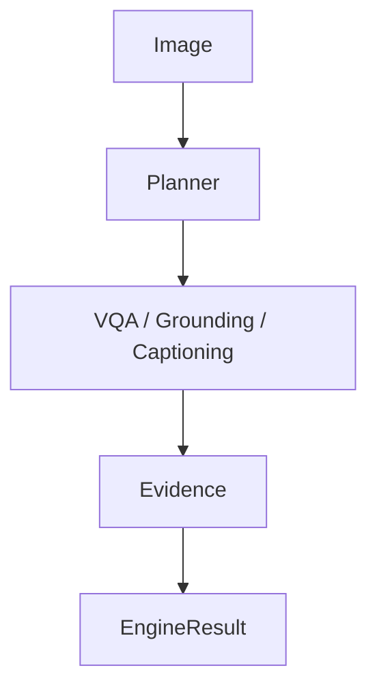
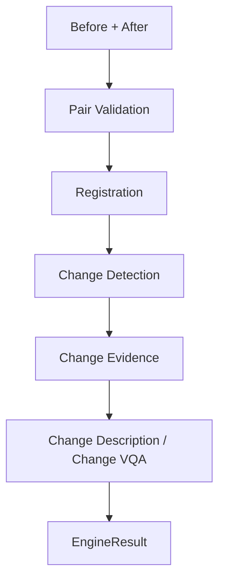
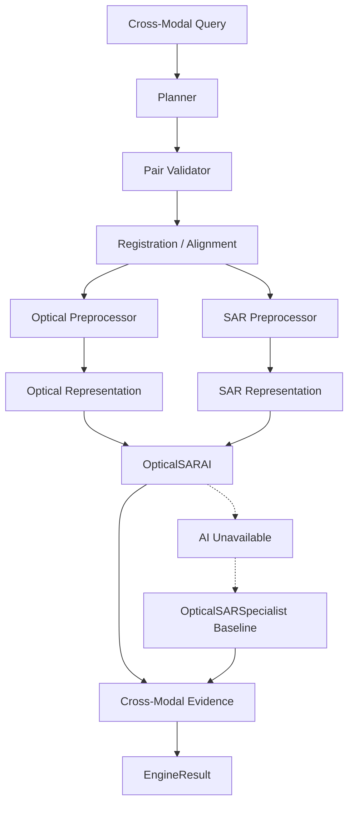
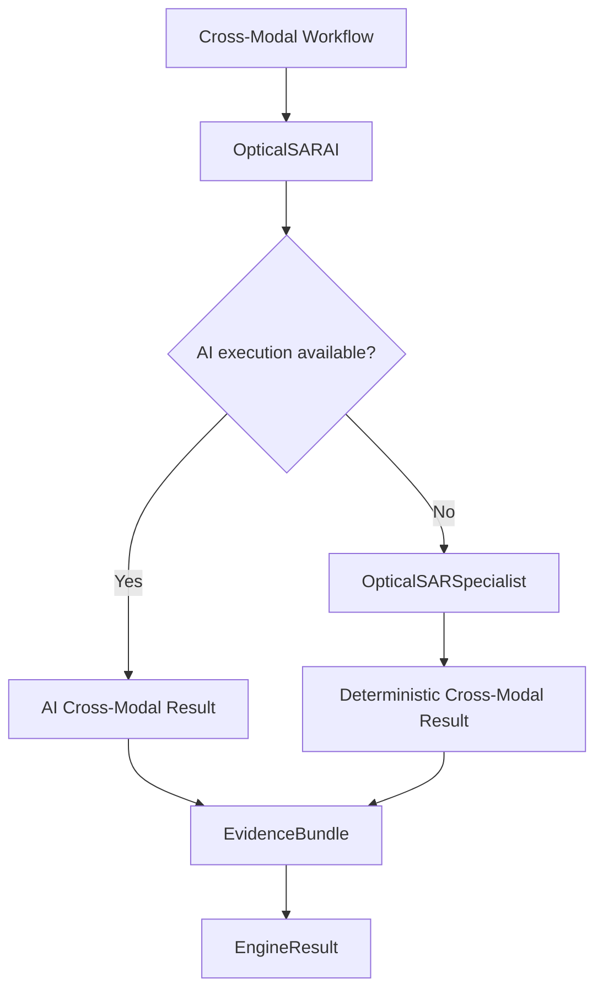

# SatQuery Architecture

SatQuery AI uses a model-agnostic, deterministic execution architecture designed to support multimodal remote sensing capabilities. 

## High-Level Execution Architecture

## Core Components
- **Planner**: A rule-based component that maps natural language + inputs to a structured WorkflowPlan.
- **Plan Validator**: Verifies that the task matches the available inputs (e.g. Temporal tasks require 2 images).
- **Model Registry**: Centralized registry for all available Specialist models (VQA, Change Detection, Fusion, etc.).
- **Workflow Executor**: Deterministically executes the steps defined in the plan, collects evidence, and generates the final EngineResult.
- **Specialist Models**: Independent, modular AI components that implement the `SpecialistModel` interface.

---

# Major Workflows

SatQuery supports three major workflows natively.

## 1. Single Image

## 2. Temporal

## 3. Cross-Modal

### Cross-Modal Workflow Explanation

The cross-modal workflow begins when the planner identifies a query requiring joint reasoning over a co-registered optical/multispectral and SAR pair.

The engine:

1. validates that exactly one optical/multispectral image and one SAR image are available;
2. verifies spatial compatibility and performs alignment when necessary;
3. preprocesses each modality using modality-specific pipelines;
4. creates optical and SAR representations;
5. routes both representations to the `OpticalSARAI` specialist when the AI path is available;
6. produces structured cross-modal evidence;
7. falls back to `OpticalSARSpecialist` when the AI implementation cannot execute because of missing dependencies, unavailable hardware, or runtime limitations;
8. returns the resulting evidence through the standard `EngineResult`.

The fallback path is intentional and allows SatQuery to remain usable on low-spec development hardware.

| Component               | Role                                                   |
| ----------------------- | ------------------------------------------------------ |
| Optical / Multispectral | Spectral and contextual information                    |
| SAR                     | Structural/backscatter information                     |
| Registration            | Ensures both modalities refer to the same spatial grid |
| OpticalSARAI            | Cross-modal AI representation/reasoning path           |
| OpticalSARSpecialist    | Deterministic CPU-capable fallback                     |
| EvidenceBundle          | Stores modality-specific and cross-modal evidence      |

---

## AI vs Fallback Execution

The ability to gracefully degrade to deterministic baselines is a core architectural requirement for executing in low-spec environments.

