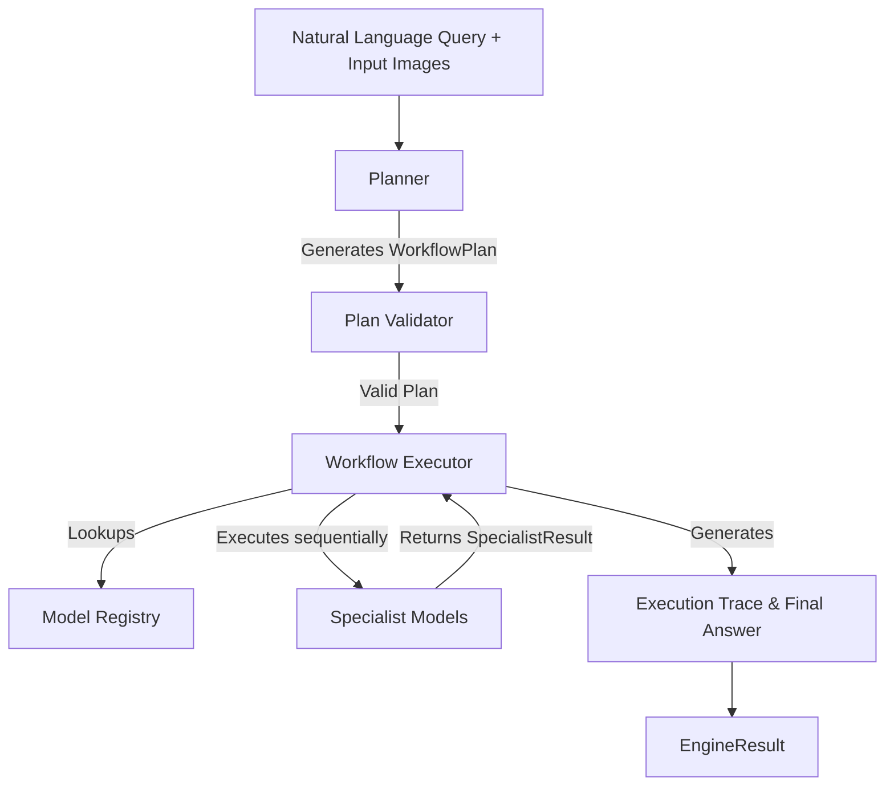
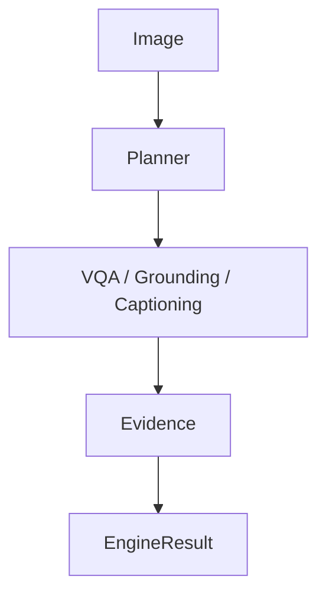
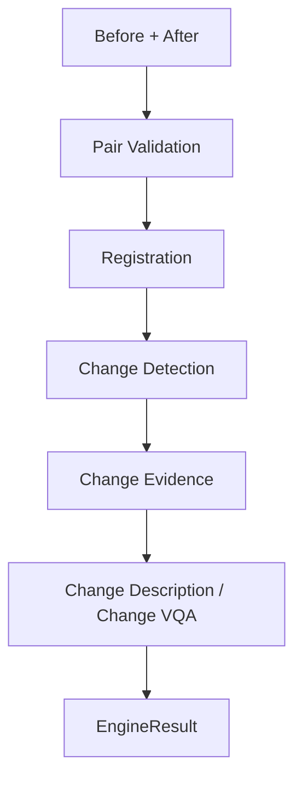
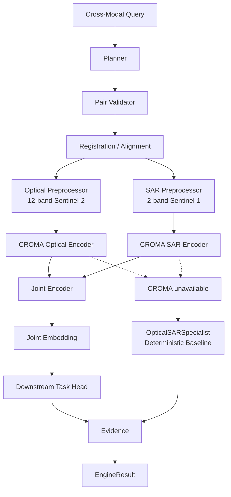

# SatQuery Architecture

SatQuery AI uses a model-agnostic, deterministic execution architecture designed to support multimodal remote sensing capabilities. 

## High-Level Execution Architecture

## Core Components
- **Planner**: A rule-based component that maps natural language + inputs to a structured WorkflowPlan.
- **Plan Validator**: Verifies that the task matches the available inputs (e.g. Temporal tasks require 2 images).
- **Model Registry**: Centralized registry for all available Specialist models (VQA, Change Detection, Fusion, etc.).
- **Workflow Executor**: Deterministically executes the steps defined in the plan, collects evidence, and generates the final EngineResult.
- **Specialist Models**: Independent, modular AI components that implement the `SpecialistModel` interface.

---

# Major Workflows

SatQuery supports three major workflows natively.

## 1. Single Image

## 2. Temporal

## 3. Cross-Modal

### Cross-Modal Workflow Explanation

The cross-modal workflow uses a real pretrained CROMA (Contrastive Radar-Optical Masked Autoencoder) model to extract joint multimodal representations.

The engine:

1. validates that exactly one optical/multispectral image and one SAR image are available;
2. verifies spatial compatibility and performs alignment when necessary;
3. preprocesses optical input (strictly requiring 12-channel Sentinel-2) and SAR input (strictly requiring 2-channel Sentinel-1);
4. routes both representations to the `CROMASpecialist` adapter;
5. generates a joint Global Average Pooling (`joint_GAP`) embedding;
6. delegates reasoning to a lightweight downstream task head to produce structured cross-modal evidence;
7. falls back to the deterministic `OpticalSARSpecialist` heuristic baseline when the PyTorch model cannot execute (e.g., missing dependencies, unavailable hardware, or runtime limitations);
8. returns the resulting evidence through the standard `EngineResult`.

The fallback path is intentional and allows SatQuery to remain usable on low-spec development hardware.

| Component               | Role                                                   |
| ----------------------- | ------------------------------------------------------ |
| Optical / Multispectral | Spectral and contextual information (12-band Sentinel-2) |
| SAR                     | Structural/backscatter information (2-band Sentinel-1) |
| Registration            | Ensures both modalities refer to the same spatial grid |
| Pretrained CROMA        | Base foundation model for cross-modal embedding        |
| Task Head               | Lightweight reasoning applied to the joint embedding   |
| OpticalSARSpecialist    | Deterministic CPU-capable fallback heuristic           |
| EvidenceBundle          | Stores representation parameters or spatial bounding boxes |
