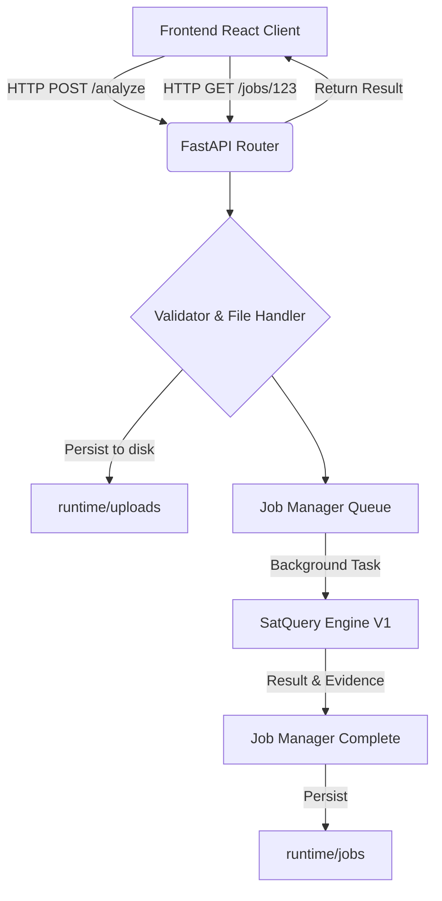

# SatQuery AI — Backend Master Software Requirements Specification

## Title Page
**Project**: SatQuery AI  
**Document**: Backend Master Software Requirements Specification (SRS)  
**Version**: 1.0  
**Target**: National-Level Hackathon (Smart India Hackathon)  
**Engine Status**: Engine V1 (FROZEN)

---

## 1. Executive Summary
SatQuery AI requires a robust, scalable, and independent backend service to bridge the interactive frontend with the deep learning `SatQueryEngine` core. This Backend SRS defines a FastAPI-based REST architecture that manages file uploads, job queueing, schema validation, structured error handling, and evidence serving, without replicating or interfering with the underlying agentic engine logic.

## 2. Scope
This document strictly dictates the backend service layer (`backend/`). It encompasses HTTP route definitions, API contracts, local file storage handling, job lifecycle orchestration, security constraints, and Python dependency structures. It strictly forbids modifying the frozen `engine/` directory.

## 3. Objectives
- Expose a stable REST API for the frontend.
- Protect the Engine V1 from invalid requests, path traversal, and malicious uploads.
- Ensure the application runs efficiently on low-spec hackathon development machines (e.g. limiting concurrency).
- Serialize `EngineResult`, `EvidenceBundle`, and `ExecutionTrace` precisely.
- Maintain absolute separation of concerns between API logic and Engine logic.

## 4. Stakeholders
- **Project Lead**: Defines architecture and ensures SIH problem statement compliance.
- **Backend Developer**: Primary consumer of this SRS, responsible for implementing the FastAPI service.
- **Frontend Developer**: Relies on the API contract specified herein.

---

## 5. Technology Decision

**Selected Stack**: **FastAPI + Pydantic + Uvicorn**
- **FastAPI**: Extremely fast, natively async, automatic OpenAPI generation, perfect for Python ML integration.
- **Pydantic**: Guarantees type safety and validation of complex Engine inputs.
- **Uvicorn**: Lightweight ASGI server.
- **Storage**: Local filesystem (`runtime/`).
- **Rejected Technologies**: Redis, PostgreSQL, Celery, Kafka. A hackathon MVP must be demoable instantly on a low-spec laptop without Dockerizing massive microservices. 

---

## 6. System Architecture



---

## 7. Backend Project Structure

```text
backend/
├── app/
│   ├── main.py
│   ├── config.py
│   ├── api/
│   │   ├── routes_analysis.py
│   │   ├── routes_jobs.py
│   │   ├── routes_evidence.py
│   │   └── routes_system.py
│   ├── schemas/
│   │   ├── requests.py
│   │   ├── responses.py
│   │   └── engine_types.py
│   ├── services/
│   │   ├── engine_service.py
│   │   └── report_service.py
│   ├── jobs/
│   │   └── manager.py
│   └── storage/
│       ├── files.py
│       └── cleanup.py
└── tests/
```

---

## 8. Engine Integration Contract

The backend must integrate with `engine.core.SatQueryEngine`.
The `engine_service.py` is the **only** file that imports from `engine.core`.
```python
# Pseudo-code expectation
from engine.core import SatQueryEngine
from engine.contracts import InputBundle, ImageAsset

engine = SatQueryEngine()

def run_analysis_task(job_id: str, query: str, file_paths: List[str]):
    # create assets
    # run engine.analyze()
    # serialize result
```
The backend must NOT implement any prompt parsing, tool selection, or fallback logic.

---

## 9. API Versioning

All endpoints are mounted under `/api/v1`.
Future endpoints (if needed for production scaling post-hackathon) will be `/api/v2`.

---

## 10. Analysis Request Endpoint

`POST /api/v1/analyze`
**Content-Type**: `multipart/form-data`
**Parameters**:
- `query` (string, required): The natural language query.
- `files` (List[UploadFile], required): 1 or 2 GeoTIFF images.

**Behavior**:
1. Validate MIME types and file extensions.
2. Save files to a unique `runtime/jobs/{job_id}/inputs/` directory.
3. Queue job.
4. Return `202 Accepted` with `{ "job_id": "uuid" }`.

---

## 11. Job Retrieval Endpoints

`GET /api/v1/jobs/{job_id}`
Returns the current status.
```json
{
  "job_id": "uuid",
  "status": "queued|running|completed|failed",
  "created_at": "timestamp"
}
```

`GET /api/v1/jobs/{job_id}/result`
Returns the serialized `EngineResult` if completed. If not completed, returns 404 or 400.

---

## 12. Upload Security

- **Path Traversal**: Generate UUIDs for filenames. Never use the user-provided filename directly on the filesystem.
- **Limits**: Maximum 50MB per file (configurable via `MAX_UPLOAD_SIZE`).
- **Extensions**: Must strictly end in `.tif` or `.tiff`.
- **MIME**: Must verify binary header if possible, or fallback to python-multipart validation.

---

## 13. Geospatial Input Validation

**Separation of Concerns**:
- **Backend**: Validates size, extension, HTTP headers.
- **Engine**: Validates CRS, bounding box overlap, number of bands, pixel types.
If the engine throws a validation error, the backend maps it to a `FAILED` job status with an `INVALID_INPUT` error code.

---

## 14. Job Architecture

A lightweight in-memory dictionary `Dict[str, Job]` suffices for MVP.
Statuses:
- `QUEUED`: Waiting for a background thread.
- `RUNNING`: Engine is currently analyzing.
- `COMPLETED`: Result saved to disk.
- `FAILED`: Engine threw an exception.

State is persisted to disk (`runtime/jobs.json`) to survive minor restarts.

---

## 15. Job Execution Flow

1. Controller receives HTTP request.
2. Saves files to disk.
3. Inserts `Job` into memory dict as `QUEUED`.
4. Dispatches `asyncio.create_task(engine_worker(job_id))`.
5. Returns `job_id`.
6. Worker updates status to `RUNNING`.
7. Worker calls `SatQueryEngine.analyze()`.
8. Worker writes `EngineResult` JSON to disk.
9. Updates status to `COMPLETED`.

---

## 16. Concurrency Management

**CRITICAL for MVP**:
- Set `MAX_CONCURRENT_JOBS=1`.
- Because the MVP runs on a standard laptop, running two massive PyTorch models concurrently will OOM the GPU/RAM.
- Incoming jobs while `RUNNING` goes into `QUEUED`.

---

## 17. Result Serialization

Define Pydantic schemas in `schemas/engine_types.py` that strictly mirror `engine/contracts.py`.
```python
class SpecialistResultSchema(BaseModel):
    status: str
    model_name: str
    task: str
    answer: Any
    confidence: Optional[float]
    evidence: EvidenceBundleSchema
    metadata: Dict[str, Any]
    execution_time: float
```

---

## 18. Evidence API

`GET /api/v1/jobs/{job_id}/evidence/{evidence_id}`
Returns raw binary evidence files (e.g., PNG masks, overlays) generated by the engine and stored in `runtime/jobs/{job_id}/output/`.
Returns `Content-Type: image/png`.

---

## 19. Trace API

`GET /api/v1/jobs/{job_id}/trace`
Returns `EngineResult.execution_trace`. This provides transparency to the frontend without requiring the whole result payload.

---

## 20. Fallback Preservation

The backend must explicitly map `EvidenceBundle.metadata["fallback_triggered"]` to the API response. It must never mask or modify this flag. The UI depends on it to render the scientific honesty alert.

---

## 21. Confidence Integrity

If `EngineResult.confidence` is `None`, the Pydantic schema must allow `None`.
```python
confidence: Optional[float] = Field(default=None)
```
The backend must never substitute `None` with `0` or `1.0`.

---

## 22. Error Model

Structured errors in API responses:
```json
{
  "code": "MODEL_UNAVAILABLE",
  "message": "PyTorch could not be initialized.",
  "details": "..."
}
```
HTTP 400 for bad inputs, HTTP 500 for engine crashes.

---

## 23. Health Endpoint

`GET /api/v1/health`
```json
{
  "status": "healthy",
  "version": "1.0",
  "engine_status": "loaded"
}
```
Must execute instantly. DO NOT import Torch or load CROMA in this endpoint.

---

## 24. Capabilities Endpoint

`GET /api/v1/capabilities`
Returns the list of supported `TaskType` and `InputType` values natively exported by the Engine's `ModelRegistry`.

---

## 25. Report Generation

`GET /api/v1/jobs/{job_id}/report`
Generates a downloadable markdown or JSON report combining the query, answers, and execution trace for auditability.

---

## 26. Configuration

Managed via `pydantic-settings` (`config.py`).
- `HOST`: `0.0.0.0`
- `PORT`: `8000`
- `RUNTIME_DIR`: `./runtime`
- `MAX_CONCURRENT_JOBS`: `1`
- `MODEL_MODE`: `mock` | `real`

---

## 27. CORS

Defined in `main.py` via `CORSMiddleware`.
Default to `http://localhost:5173` (Vite) and `http://localhost:3000` (Next.js).
Allow `*` during initial hackathon presentation ONLY if explicitly toggled via `.env`.

---

## 28. Logging

Use standard python `logging` or `loguru`.
Format: `[INFO] {timestamp} [Job:{job_id}] - Engine executed TaskType.CROMA_CLASSIFICATION in 1.4s`
No sensitive user queries are logged to external aggregators.

---

## 29. Observability

Attach a `X-Request-ID` header to all HTTP responses via middleware to trace API latency versus Engine latency.

---

## 30. File Storage Architecture

```text
runtime/
  ├── jobs/
  │   ├── <job_id>/
  │   │   ├── inputs/     (uploaded tiffs)
  │   │   ├── output/     (evidence pngs)
  │   │   └── result.json (cached result)
```

---

## 31. Large Raster Handling

FastAPI `UploadFile` uses spooling. Files > 1MB are automatically written to disk, preventing RAM exhaustion during the HTTP request lifecycle. The backend simply passes the file paths to the Engine.

---

## 32. Cleanup Policy

A background `cleanup.py` script or lifecycle hook deletes job directories older than 24 hours to prevent SSD exhaustion on the presenter's laptop.

---

## 33. Security Threat Model

- **Huge Upload**: Mitigated by `MAX_UPLOAD_SIZE`.
- **Zip Bomb**: Archives explicitly rejected by extension/MIME checkers.
- **Path Traversal**: Filenames replaced by internal UUIDs.

---

## 34. API Schemas

Example Success Response:
```json
{
  "request_id": "uuid",
  "status": "success",
  "query": "Find water",
  "task": "cross_modal_optical_sar",
  "answer": "Found 1 region of agreement.",
  "confidence": null,
  "specialist_results": [],
  "evidence": [...],
  "execution_trace": [...]
}
```

---

## 35. Frontend Integration Contract

The frontend solely interacts with `/api/v1/analyze` and polls `/api/v1/jobs/{id}`.
The backend promises to NEVER change the Pydantic schemas without bumping the API version.

---

## 36. Development Mode (Mocking)

If `MODEL_MODE=mock`, the backend provisions the Engine with the `ModelRegistry` initialized in mock mode. The API behaves identically but returns instantly.

---

## 37. Real AI Mode

If `MODEL_MODE=real`, the backend initializes the Engine in real mode. The backend handles the latency gracefully via asynchronous polling.

---

## 38. Testing Strategy

- `pytest`
- `httpx` `AsyncClient` for API testing.
- Target: 60+ API test cases.
- Must mock `SatQueryEngine.analyze` for pure backend validation tests.

---

## 39. Contract Testing

Ensure `test_api_contract.py` validates that the JSON emitted by the backend exactly matches the expected TypeScript interfaces defined in the Frontend SRS.

---

## 40. Performance Benchmarks

- API routing latency < 10ms.
- Engine latency isolated via background tasks.
- Upload throughput dictated by local disk I/O.

---

## 41. Deployment Architecture

Run via standard shell script:
```bash
uvicorn backend.app.main:app --host 0.0.0.0 --port 8000
```
Docker is optional but not required for MVP presentation.

---

## 42. API Documentation

Auto-generated at:
- `/docs` (Swagger UI)
- `/redoc` (ReDoc UI)

---

## 43. Acceptance Criteria (70+ points)

**Examples:**
- `BE-001` Server starts successfully
- `BE-002` Swagger docs accessible
- `BE-003` Health returns 200
- `BE-004` Capabilities list all tasks
- `BE-005` Reject non-TIFF files
- `BE-006` Accept up to 2 files
- `BE-007` Create Job returns UUID
- `BE-008` Job state QUEUED
- `BE-009` Engine called with correct paths
- `BE-010` Job state COMPLETED
- `BE-011` Result endpoint returns schema
- `BE-012` Evidence endpoint returns PNG
... *(Developer to write remaining criteria as unit tests)*.

---

## 44. Implementation Plan

1. Bootstrap FastAPI & Pydantic.
2. Configure Settings.
3. Map Engine Contracts to Pydantic.
4. Storage service & upload routes.
5. In-memory Job Queue.
6. Engine Worker Thread.
7. Result endpoints.
8. Tests.

---

## 45. Git Rules

- Branch: `feat/backend`.
- Do NOT touch `engine/` or `frontend/`.
- Commits must use `feat(backend): ...` or `fix(backend): ...`.

---

## 46. Engine Change Policy

Engine V1 is frozen. If the backend uncovers a defect, document it as a GitHub issue. Do NOT silence errors or hack the engine internals.

---

## 47. Merge Strategy

Upon completion, `feat/backend` will be merged into `main` alongside `feat/frontend` and `feat/engine-core`. Directory ownership guarantees no merge conflicts.

---

## 48. Risk Register

- **Risk**: Process restart drops in-memory queue.
  - **Mitigation**: Jobs are persisted to `runtime/jobs.json` before execution.
- **Risk**: Concurrent large TIFF requests OOM the server.
  - **Mitigation**: Hardcoded `MAX_CONCURRENT_JOBS=1`.

---

## 49. Glossary

- **ASGI**: Asynchronous Server Gateway Interface
- **Pydantic**: Data validation library
- **Engine**: The underlying `SatQueryEngine`

---

## 50. References

- FastAPI Documentation: https://fastapi.tiangolo.com/
- Engine V1 SRS: `docs/engine-v1.md`
- Frontend SRS: `docs/frontend-srs.md`
