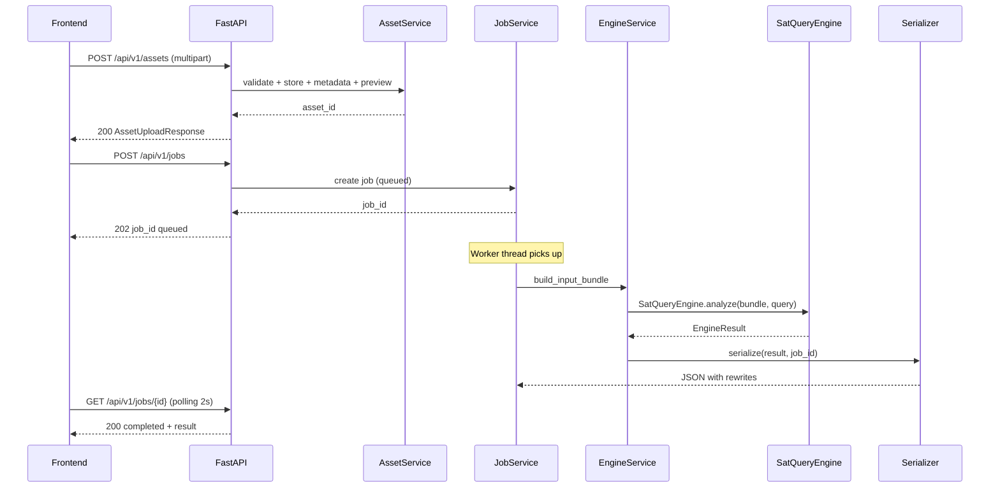
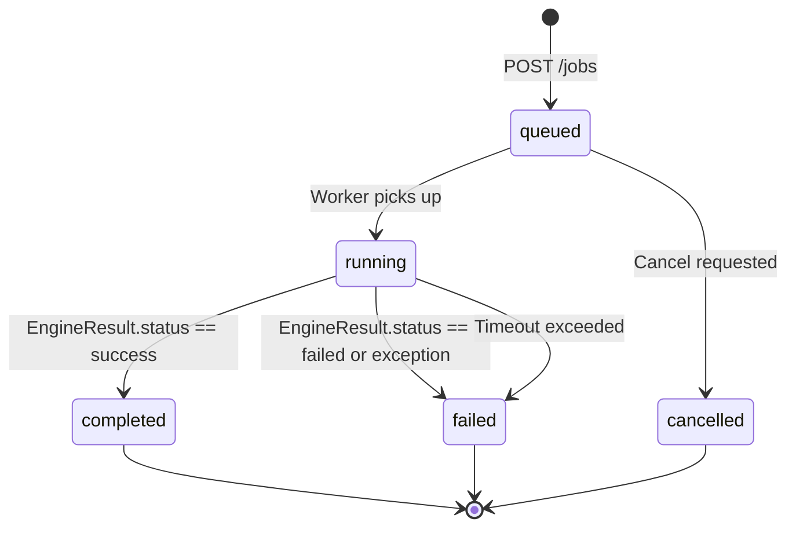
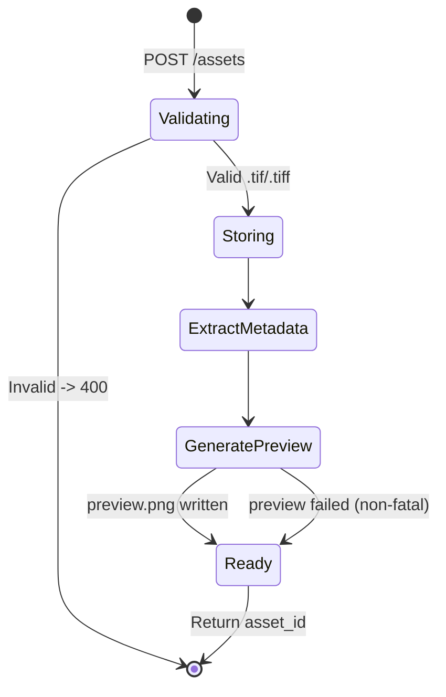

# SatQuery AI — Backend Software Requirements Specification

**Document Type:** Implementation-Ready Engineering Specification  
**Target Consumer:** Backend Developer (AI Agent or Human)  
**Project:** SatQuery AI — National-Level Hackathon (Smart India Hackathon)  
**Repository:** https://github.com/HEAVENLYBEING112/satquery-ai  
**Backend Branch:** feat/backend  
**Engine Branch:** feat/engine-core  
**Engine Version:** SatQuery Engine V1  
**Engine Status:** FROZEN  
**SRS Version:** 2.0 (Forensic Audit Edition)  
**Date:** 2026-09-01

---

## Revision History

| Version | Date | Author | Summary |
|---|---|---|---|
| 1.0 | 2026-08-30 | Project Lead | Initial placeholder draft (511 lines, 14 KB) |
| 2.0 | 2026-09-01 | Principal Backend Architect | Complete rewrite from forensic source audit. All contracts verified against actual code on origin/feat/engine-core at HEAD 93fbaf1. Stale commit hash discrepancy identified and resolved. |

---

## 1. Document Control

This document is the **canonical authority** for the SatQuery AI backend API. The frontend SRS (docs/frontend-srs.md) consumes this API. If they conflict, this document governs.

**Source of truth priority:**
1. Actual Python source on origin/feat/engine-core
2. This backend SRS
3. docs/frontend-srs.md

---

## 2. Executive Summary

SatQuery AI Engine V1 is a frozen Python computation core. The backend is a pure **adapter and orchestration layer** that translates HTTP requests into Engine V1 contracts, invokes SatQueryEngine.analyze(), and serializes EngineResult objects into JSON responses suitable for the React frontend.

The backend developer reads this document, clones the repository, implements the FastAPI service in backend/, and produces a merge-ready branch without asking the project lead for a single architectural decision.

### Architecture:

## 3. Project Context

SatQuery AI is a national-level hackathon submission (Smart India Hackathon). It allows domain users to upload satellite imagery (optical / SAR) and query it in natural language. Engine V1 routes the query, selects specialists, and returns structured evidence.

**Low-spec laptop constraint is permanent.** All concurrency and resource decisions must target a machine with 8-16 GB RAM, possibly no GPU, running Windows or Linux.

---

## 4. Forensic Audit — Commit Hash Discrepancy Resolution

> This is a critical finding.

The prompt said Engine V1 was frozen at commit 93fbaf1 but a prior session summary referenced 2bb34cfab4b5aa194d14b2d4c33032cf255d5cac as the Engine V1 commit.

**Actual audit result (git log --oneline -5 origin/feat/engine-core):**

```
93fbaf1  feat: complete and stabilize satquery engine v1   <- HEAD (most recent)
64aa587  docs: add remote sensing learning guide
2bb34cf  feat: establish real CROMA evaluation pipeline
cad25a7  feat: implement real CROMA downstream classifier
5bf1864  feat: integrate real pretrained CROMA model adapter
```

**Resolution:** 93fbaf1 IS the actual frozen HEAD of feat/engine-core. The commit 2bb34cf was an intermediate development commit. The prompt was correct. The prior session summary contained a stale intermediate hash.

Backend developer must work against origin/feat/engine-core at 93fbaf1. Never reference 2bb34cf as the engine version.

---

## 5. Forensic Audit — Engine V1 File Tree

Files confirmed present on origin/feat/engine-core at 93fbaf1:

```
engine/__init__.py                 # exports SatQueryEngine
engine/agent/__init__.py
engine/agent/executor.py            # WorkflowExecutor
engine/agent/planner.py             # Planner (routing)
engine/agent/registry.py            # ModelRegistry
engine/agent/router.py
engine/contracts.py                  # ALL data contracts (source of truth)
engine/core.py                       # SatQueryEngine entry point
engine/data/__init__.py
engine/data/base.py
engine/data/cdvqa.py
engine/data/manifest.py
engine/evidence/__init__.py
engine/evidence/confidence.py
engine/evidence/trace.py
engine/evidence/validator.py        # PlanValidator
engine/geospatial/__init__.py
engine/geospatial/loader.py         # RasterLoader
engine/geospatial/metadata.py       # BandInfo, extract_band_stats
engine/geospatial/modality.py       # detect_modality()
engine/geospatial/preprocessing.py
engine/geospatial/registration.py   # register_pair()
engine/geospatial/tiling.py
engine/geospatial/visualization.py  # draw_bounding_boxes()
engine/pipeline.py                  # CLI entry point
```

> CRITICAL: engine/models/ directory does not exist on origin/feat/engine-core. registry.py imports from engine.models.* but those paths exist only in the local feat/backend working copy. This is a repository divergence. The backend implementation must NOT recreate or modify engine/models/. Before merge, the project lead must establish the authoritative source of these model modules and ensure the final feat/backend tree contains the complete runtime required by ModelRegistry.

---

## 6. Engine Contract Forensics

All fields verified against engine/contracts.py on origin/feat/engine-core at 93fbaf1.

### 6.1 TaskType

| Value | String | Routing Trigger |
|---|---|---|
| SINGLE_IMAGE_VQA | single_image_vqa | 1 optical, no keyword match |
| SINGLE_IMAGE_CAPTION | single_image_caption | 1 optical + describe |
| SINGLE_IMAGE_GROUNDING | single_image_grounding | 1 optical + highlight/ground |
| TEMPORAL_CHANGE_DETECTION | temporal_change_detection | 2 optical + change (no what/describe) |
| TEMPORAL_CHANGE_DESCRIPTION | temporal_change_description | 2 optical + change + what/describe |
| TEMPORAL_CHANGE_VQA | temporal_change_vqa | 2 optical + other |
| CROSS_MODAL_OPTICAL_SAR | cross_modal_optical_sar | optical + SAR, no classify keyword |
| CROMA_CLASSIFICATION | croma_classification | optical + SAR + classify/land-cover/identify water |

### 6.2 InputType (str, Enum)

| Value | String |
|---|---|
| SINGLE_OPTICAL | single_optical |
| SINGLE_MULTISPECTRAL | single_multispectral |
| SINGLE_SAR | single_sar |
| TEMPORAL_OPTICAL | temporal_optical |
| TEMPORAL_SAR | temporal_sar |
| OPTICAL_SAR_PAIR | optical_sar_pair |

BUG: determine_input_type() never returns SINGLE_MULTISPECTRAL. A multispectral image needs modality=optical to route correctly. Backend must set modality=optical for multispectral images.

### 6.3 ImageAsset Fields

| Field | Type | Required | Notes |
|---|---|---|---|
| id | str | YES | Backend generates UUID |
| path | str | YES | Server filesystem path — NEVER expose to client |
| filename | str | YES | Original filename — used by modality heuristics |
| format | str | YES | GeoTIFF for .tif |
| modality | str | YES | optical, sar, multispectral |
| width | Optional[int] | NO | From rasterio |
| height | Optional[int] | NO | From rasterio |
| bands | Optional[int] | NO | From rasterio |
| crs | Optional[str] | NO | e.g. EPSG:4326 |
| resolution | Optional[float] | NO | rasterio res[0] |
| acquisition_time | Optional[str] | NO | ISO 8601 — used for temporal ordering |
| bbox | Optional[List[float]] | NO | [minx, miny, maxx, maxy] |
| metadata | Dict[str, Any] | YES default {} | dtype, nodata, transform, bounds |

### 6.4 InputBundle Key Properties

| Property | Logic |
|---|---|
| has_optical | Any image has modality == optical |
| has_sar | Any image has modality == sar |
| is_temporal | image_count >= 2 AND len(modalities) == 1 |
| is_cross_modal | len(modalities) > 1 |
| before | Sorted by acquisition_time ISO 8601 or images[0] |
| after | The other image from before |
| optical_image | First image with modality in [optical, multispectral] |
| sar_image | First image with modality == sar |

### 6.5 BoundingBox Fields

| Field | Type | Required | Notes |
|---|---|---|---|
| label | str | YES | e.g. water_agreement, changed_region |
| coordinates | List[float] | YES | [xmin, ymin, xmax, ymax] — pixel OR geographic |
| confidence | Optional[float] | NO | May be null |
| source | str | YES default model | optical, sar, cross_modal, croma_classifier |

Backend MUST add coordinate_type field when serializing: pixel or geo.

### 6.6 ChangeMask Fields

| Field | Type | Required | Notes |
|---|---|---|---|
| width | int | YES | Mask pixel width |
| height | int | YES | Mask pixel height |
| mask_path | Optional[str] | NO | Server filesystem path — NEVER expose raw |
| threshold_used | Optional[float] | NO | |
| changed_pixel_count | int | YES default 0 | |
| changed_fraction | float | YES default 0.0 | 0.0 to 1.0 |

### 6.7 EvidenceBundle Fields

| Field | Type | Notes |
|---|---|---|
| textual_evidence | Optional[str] | Plain text |
| bounding_boxes | List[BoundingBox] | default [] |
| visualizations | List[str] | Server filesystem paths — backend rewrites to URLs |
| change_statistics | Optional[Dict[str, Any]] | Key-value stats |
| change_mask | Optional[ChangeMask] | |
| metadata | Dict[str, Any] | Contains fallback_triggered, fallback_reason |

Known fallback metadata keys (from CROMASpecialist source):
- fallback_triggered: True (boolean)
- fallback_reason: CROMA hardware/dependencies unavailable OR CROMA Classifier head missing

### 6.8 SpecialistResult Fields

| Field | Type | Notes |
|---|---|---|
| status | str | success or error |
| model_name | str | e.g. MockVQA, baseline_change_detector |
| task | TaskType | |
| answer | Any | Usually str, may be None |
| confidence | Optional[float] | May be null — NEVER coerce |
| evidence | EvidenceBundle | |
| metadata | Dict[str, Any] | |
| execution_time | float | Seconds |
| error | Optional[str] | Message if status=error |

### 6.9 EngineError Fields

| Field | Type | Values |
|---|---|---|
| code | str | PLANNING_FAILED, INVALID_WORKFLOW, NO_COMPATIBLE_TOOL, UNSUPPORTED_TASK, MODEL_EXECUTION_FAILED, INTERNAL_ENGINE_ERROR |
| message | str | Human-readable |

### 6.10 EngineResult Fields

| Field | Type | Notes |
|---|---|---|
| request_id | str | UUID from SatQueryEngine |
| status | str | success or failed |
| query | str | Original query |
| task | Optional[TaskType] | Null if planning failed |
| answer | Any | Final answer or None |
| confidence | Optional[float] | NULLABLE — NEVER coerce to any default |
| specialist_results | List[SpecialistResult] | Empty on failure |
| evidence | List[EvidenceBundle] | One per specialist step |
| execution_trace | List[Dict] | One dict per step |
| errors | List[EngineError] | BUG: field(default_factory=dict) returns {} on success. Backend must coerce. |

### 6.11 Execution Trace Dict Keys (verified from executor.py lines 87-95)

```python
{
    "step": int,           # 1-based
    "tool": str,           # Tool name
    "task": str,           # TaskType.value string
    "status": str,         # success or error
    "parameters": dict,    # Step parameters
    "duration_ms": int,    # Milliseconds
    "result_summary": Any  # The specialist answer
}
```

### 6.12 Confidence Semantics (verified from executor.py)

```text
final_confidence starts at 1.0

for each step:
    if result.confidence is not None:
        final_confidence = min(final_confidence, result.confidence)

After all steps:
    if final_confidence == 1.0:
        if NO specialist returned non-None confidence:
            final_confidence = None    <- ALL null -> EngineResult.confidence = None
    if no specialists ran AND still 1.0:
        final_confidence = 0.0
```

Rule: If EngineResult.confidence is None, serialize as JSON null. Never substitute 0, 0.5, or any default.

---

## 7. Engine Immutability Rules

Hard constraints — violation = SRS non-compliance.

| Rule | Detail |
|---|---|
| Do NOT modify | engine/ directory — any file |
| Do NOT import | frontend code into backend |
| Do NOT duplicate | Planner routing logic |
| Do NOT duplicate | ModelRegistry registration logic |
| Do NOT reimplement | Task determination (determine_input_type) |
| Do NOT call | Any engine class other than SatQueryEngine.analyze() |
| Do NOT create | Independent confidence calculation |
| Do NOT create | Independent fallback detection |
| Must call | SatQueryEngine(registry=ModelRegistry()).analyze(input_bundle, query) |
| Must preserve | All nullable fields as nullable in API response |
| Must rewrite | Filesystem paths to URLs before API response |

---

## 8. Frontend SRS Integration Contract

docs/frontend-srs.md (forensic audit edition, feat/frontend branch) requires these endpoints:

```text
POST /api/v1/assets
GET  /api/v1/assets/{asset_id}/preview
POST /api/v1/jobs
GET  /api/v1/jobs/{job_id}
GET  /api/v1/jobs/{job_id}/trace
GET  /api/v1/jobs/{job_id}/report
GET  /api/v1/jobs/{job_id}/evidence/{filename}
GET  /api/v1/health
GET  /api/v1/capabilities
```

All 9 endpoints are compatible with Engine V1. The backend must implement exactly these paths.

---

## 9. API Conflict Analysis

| # | Conflict | Resolution |
|---|---|---|
| 1 | Frontend expects mask_url. Engine returns mask_path as filesystem path. | Backend rewrites ChangeMask.mask_path to /api/v1/jobs/{id}/evidence/{filename}. Field renamed mask_url in API schema. |
| 2 | Frontend expects visualizations as URLs. Engine returns filesystem paths. | Backend rewrites all strings in EvidenceBundle.visualizations to /api/v1/jobs/{id}/evidence/{filename} URLs. |
| 3 | Frontend expects BoundingBox.coordinate_type. Engine BoundingBox has no such field. | Backend adds coordinate_type: pixel or geo during serialization. |
| 4 | Frontend expects errors as List always. Engine has field(default_factory=dict) which returns {} on success. | Backend coerces: if isinstance(errors, dict): errors = [] |
| 5 | Frontend expects confidence as number or null. Engine Optional[float]. | No conflict. Backend must keep Optional and never coerce. |
| 6 | Frontend expects web-viewable preview images. Engine generates no previews. | Backend generates PNG preview during asset upload. |

---

## 10. Backend Scope and Boundaries

Backend owns:
- backend/ entire directory
- backend/tests/ all API and integration tests

Backend must NOT touch:
- engine/ any file
- frontend/ any file  
- docs/frontend-srs.md
- tests/ at root (engine tests)

---

## 11. Assumptions and Constraints

| Item | Detail |
|---|---|
| Python version | 3.10+ |
| Dependency management | requirements/ directory with base.txt, cpu.txt, gpu.txt. No pyproject.toml. |
| No existing FastAPI code | backend/ does not exist. Start from scratch. |
| No database | In-memory + filesystem for hackathon MVP |
| No authentication | Not required for SIH demo |
| Low-spec laptop | Max 1 concurrent engine job. No GPU assumed. |
| Accepted formats | .tif and .tiff (RasterLoader also accepts .png/.jpg but frontend only uploads .tif) |
| outputs/ is gitignored | Engine writes here by default. Backend must redirect to job-specific dir. |

---

## 12. Backend Architecture

```text
backend/
    app/
        main.py              #FastAPI app, CORS, routers, startup
        config.py            #Settings (pydantic-settings, env vars)
        dependencies.py      #FastAPI Depends() providers
        api/
            __init__.py
            assets.py        #POST /api/v1/assets
            jobs.py          #POST/GET /api/v1/jobs/*
            system.py        #GET /api/v1/health, /capabilities
            errors.py        #Global exception handlers
        schemas/
            __init__.py
            assets.py        #AssetUploadResponse
            jobs.py          #JobSubmitRequest, JobResponse
            engine.py        #EngineResultResponse etc.
            errors.py        #ApiError schema
            system.py        #HealthResponse, CapabilitiesResponse
        services/
            __init__.py
            asset_service.py     #Upload, store, metadata, preview
            job_service.py       #Create, poll jobs
            engine_service.py    #InputBundle construction, engine call
            evidence_service.py  #Path->URL rewriting, file serving
            report_service.py    #Report assembly
        storage/
            __init__.py
            filesystem.py    #Safe path operations
            paths.py         #Canonical path helpers
        workers/
            __init__.py
            job_worker.py    #ThreadPoolExecutor runner
        serializers/
            __init__.py
            engine_result.py #Python dataclass to Pydantic conversion
    tests/
        __init__.py
        conftest.py
        test_assets.py
        test_jobs.py
        test_engine_adapter.py
        test_evidence.py
        test_health.py
        test_security.py
        test_integration.py
    runtime/                 #GITIGNORED - created at startup
        assets/
            {asset_id}/
                original.tif
                metadata.json
                preview.png
        jobs/
            {job_id}/
                job.json
                output/      #Engine output files
    requirements-backend.txt
    .env.example
    README.md
```

---

## 13. Architecture Diagrams

### 13.1 Request-Response Sequence



### 13.2 Job State Machine



### 13.3 Asset Lifecycle



---

## 14. Technology Decisions

| Technology | Decision | Rationale |
|---|---|---|
| FastAPI | Selected | Async-native, automatic OpenAPI, minimal overhead |
| Pydantic v2 | Selected | Required for schema validation |
| Uvicorn | Selected | Lightweight ASGI |
| ThreadPoolExecutor | Selected | Engine work must not block event loop |
| In-memory dict + filesystem JSON | Selected | No DB needed for hackathon MVP |
| rasterio | Already required | Metadata extraction and preview |
| Pillow | Already required | Preview PNG generation |
| pydantic-settings | Selected | Clean environment variable loading |
| python-multipart | Required | FastAPI file upload |
| Redis/Celery | Rejected | Unnecessary for hackathon demo |
| PostgreSQL | Rejected | Overkill |
| Docker | Optional | Not required for MVP |

---

## 15. Configuration System

```python
# backend/app/config.py
from pydantic_settings import BaseSettings, SettingsConfigDict
from pathlib import Path

class Settings(BaseSettings):
    model_config= SettingsConfigDict(env_file=".env", env_file_encoding="utf-8", extra="ignore")

    api_host: str = "0.0.0.0"
    api_port: int = 8000
    log_level: str = "INFO"
    cors_origins: list = ["http://localhost:5173", "http://localhost:3000"]
    max_upload_bytes: int = 52428800  # 50 MB
    allowed_extensions: list = [".tif", ".tiff"]
    runtime_dir: Path = Path("runtime")
    job_timeout_seconds: int = 300
    max_concurrent_jobs: int = 1
    SATQUERY_MODEL_MODE: str = "mock"

    @property
    def assets_dir(self) -> Path:
        return self.runtime_dir / "assets"

    @property
    def jobs_dir(self) -> Path:
        return self.runtime_dir / "jobs"

settings = Settings()
```

Environment variables:

| Variable | Default | Description |
|---|---|---|
| API_HOST | 0.0.0.0 | Server bind address |
| API_PORT | 8000 | Server port |
| LOG_LEVEL | INFO | Logging level |
| CORS_ORIGINS | [localhost:5173] | Allowed CORS origins |
| MAX_UPLOAD_BYTES | 52428800 | 50 MB limit |
| RUNTIME_DIR | runtime | Base storage dir |
| JOB_TIMEOUT_SECONDS | 300 | Engine timeout |
| MAX_CONCURRENT_JOBS | 1 | Worker pool size |
| SATQUERY_MODEL_MODE | mock | mock or real |

---

## 16. API Contract — Complete Endpoint Specifications

### 16.1 POST /api/v1/assets — Upload Image

Content-Type: multipart/form-data  
Field: file (binary)

Validation:
- Extension must be .tif or .tiff -> 400 UNSUPPORTED_FORMAT
- Size must be <= MAX_UPLOAD_BYTES -> 413 UPLOAD_TOO_LARGE
- Filename sanitized (no .., no path separators)

Success Response 200:
```json
{
  "asset_id": "550e8400-e29b-41d4-a716-446655440001",
  "filename": "sentinel2.tif",
  "size_bytes": 4194304,
  "format": "GeoTIFF",
  "width": 512,
  "height": 512,
  "bands": 3,
  "crs": "EPSG:4326",
  "resolution": 10.0,
  "bbox": [77.1, 12.9, 77.5, 13.2],
  "preview_url": "/api/v1/assets/550e8400-e29b-41d4-a716-446655440001/preview"
}
```

width, height, bands, crs, resolution, bbox, preview_url may be null.

Errors:
- 400 UNSUPPORTED_FORMAT
- 400 INVALID_FILENAME
- 413 UPLOAD_TOO_LARGE
- 422 VALIDATION_ERROR
- 500 INTERNAL_SERVER_ERROR

### 16.2 GET /api/v1/assets/{asset_id}/preview

Returns 200 image/png or 404 ASSET_NOT_FOUND.

### 16.3 POST /api/v1/jobs — Submit Analysis

Content-Type: application/json

Request body:
```json
{
  "query": "What changed between these two dates?",
  "assets": [
    {
      "asset_id": "uuid-1",
      "modality": "optical",
      "role": "before",
      "acquisition_time": "2024-01-15T10:30:00Z"
    },
    {
      "asset_id": "uuid-2",
      "modality": "optical",
      "role": "after",
      "acquisition_time": "2024-08-10T10:30:00Z"
    }
  ]
}
```

Fields:
- query: non-empty string, max 500 chars
- assets: 1-2 elements
- asset_id: must exist in storage
- modality; optical or sar
- role: optional before or after
- acquisition_time: optional ISO 8601

Success Response 202:
```json
{
  "job_id": "550e8400-e29b-41d4-a716-446655440002",
  "status": "queued",
  "created_at": "2026-09-01T14:00:00Z"
}
```

Errors: 400 INVALID_REQUEST, 404 ASSET_NOT_FOUND, 422 VALIDATION_ERROR, 503 ENGINE_UNAVAILABLE

### 16.4 GET /api/v1/jobs/{job_id} — Poll Job

While running (200):
```json
{
  "job_id": "uuid",
  "status": "running",
  "created_at": "2026-09-01T14:00:00Z",
  "updated_at": "2026-09-01T14:00:05Z",
  "result": null
}
```

On completion (200):
```json
{
  "job_id": "uuid",
  "status": "completed",
  "created_at": "2026-09-01T14:00:00Z",
  "updated_at": "2026-09-01T14:00:18Z",
  "result": { /* EngineResultResponse */ }
}
```

On failure (200):
```json
{
  "job_id": "uuid",
  "status": "failed",
  "result": {
    "request_id": "uuid",
    "status": "failed",
    "query": "...",
    "task": null,
    "answer": null,
    "confidence": null,
    "specialist_results": [],
    "evidence": [],
    "execution_trace": [],
    "errors": [{"code": "PLANNING_FAILED", "message": "..."}]
  }
}
```

Error: 404 JOB_NOT_FOUND

### 16.5 GET /api/v1/jobs/{job_id}/trace

Response 200:
```json
{
  "job_id": "uuid",
  "trace": [
    {
      "step": 1,
      "tool": "baseline_change_detector",
      "task": "temporal_change_detection",
      "status": "success",
      "parameters": {},
      "duration_ms": 412,
      "result_summary": "3 changed regions detected."
    }
  ]
}
```

result_summary containing server path must be redacted.

Errors: 404 JOB_NOT_FOUND, 409 JOB_NOT_COMPLETE

### 16.6 GET /api/v1/jobs/{job_id}/evidence/{filename}

Returns 200 image/png binary.

Errors: 400 INVALID_FILENAME (path traversal), 404 JOB_NOT_FOUND, 404 EVIDENCE_NOT_FOUND

### 16.7 GET /api/v1/jobs/{job_id}/report

Response 200 application/json:
```
Content-Disposition: attachment; filename=satquery_report_{job_id}.json
```

Body: Full EngineResultResponse JSON. No fabricated fields.

Errors: 404 JOB_NOT_FOUND, 409 JOB_NOT_COMPLETE

### 16.8 GET /api/v1/health

Response 200:
```json
{
  "status": "healthy",
  "version": "1.0.0",
  "engine_mode": "mock",
  "engine_available": true,
  "torch_available": false,
  "cuda_available": false,
  "croma_available": false,
  "timestamp": "2026-09-01T14:00:00Z"
}
```

engine_available is true only if `from engine import SatQueryEngine` succeeds. Never fabricate.

### 16.9 GET /api/v1/capabilities

Response 200:
```json
{
  "tasks": [
    "single_image_vqa", "single_image_caption", "single_image_grounding",
    "temporal_change_detection", "temporal_change_description", "temporal_change_vqa",
    "cross_modal_optical_sar", "croma_classification"
  ],
  "input_types": [
    "single_optical", "single_multispectral", "single_sar",
    "temporal_optical", "temporal_sar", "optical_sar_pair"
  ],
  "supported_formats": ["GeoTIFF"],
  "max_upload_bytes": 52428800,
  "models": {
    "mock": ["MockVQA", "MockCaptioner", "MockGrounding", "baseline_change_detector", "optical_sar_specialist"],
    "real": ["remote_sensing_vqa", "remote_sensing_grounding", "croma_specialist"]
  },
  "engine_mode": "mock"
}
```

---

## 17. Pydantic Schemas

### 17.1 Request Schemas

```python
# backend/app/schemas/assets.py
from pydantic import BaseModel
from typing import Optional

class AssetUploadResponse(BaseModel):
    asset_id: str
    filename: str
    size_bytes: int
    format: str
    width: Optional[int] = None
    height: Optional[int] = None
    bands: Optional[int] = None
    crs: Optional[str] = None
    resolution: Optional[float] = None
    bbox: Optional[list[float]] = None
    preview_url: Optional[str] = None

# backend/app/schemas/jobs.py
from pydantic import BaseModel, Field
from typing import Optional, Literal

class AssetRef(BaseModel):
    asset_id: str
    modality: Literal["optical", "sar", "multispectral"]
    role: Optional[Literal["before", "after"]] = None
    acquisition_time: Optional[str] = None

class JobSubmitRequest(BaseModel):
    query: str = Field(..., min_length=1, max_length=500)
    assets: list[AssetRef] = Field(..., min_length=1, max_length=2)

class JobResponse(BaseModel):
    job_id: str
    status: str
    created_at: str
    updated_at: Optional[str] = None
    result: Optional[dict] = None
```

### 17.2 Engine Response Schemas

```python
# backend/app/schemas/engine.py
from pydantic import BaseModel, ConfigDict
from typing import Optional, Any, Literal

class BoundingBoxResponse(BaseModel):
    label: str
    coordinates: list[float]
    coordinate_type: Literal["pixel", "geo"]  # Added by backend serializer
    confidence: Optional[float] = None
    source: str

class ChangeMaskResponse(BaseModel):
    width: int
    height: int
    mask_url: Optional[str] = None       # Rewritten from mask_path
    threshold_used: Optional[float] = None
    changed_pixel_count: int
    changed_fraction: float

class EvidenceBundleResponse(BaseModel):
    textual_evidence: Optional[str] = None
    bounding_boxes: list[BoundingBoxResponse]
    visualizations: list[str]            # Rewritten to URLs
    change_statistics: Optional[dict[str, Any]] = None
    change_mask: Optional[ChangeMaskResponse] = None
    metadata: dict[str, Any]

class EngineErrorResponse(BaseModel):
    code: str
    message: str

class TraceStepResponse(BaseModel):
    step: int
    tool: str
    task: str
    status: str
    parameters: dict[str, Any]
    duration_ms: int
    result_summary: Any

class SpecialistResultResponse(BaseModel):
    model_config = ConfigDict(use_enum_values=True)
    status: str
    model_name: str
    task: str
    answer: Optional[str] = None
    confidence: Optional[float] = None  # NULLABLE — never coerce
    evidence: EvidenceBundleResponse
    metadata: dict[str, Any]
    execution_time: float
    error: Optional[str] = None

class EngineResultResponse(BaseModel):
    model_config = ConfigDict(use_enum_values=True)
    request_id: str
    status: str
    query: str
    task: Optional[str] = None
    answer: Optional[str] = None
    confidence: Optional[float] = None  # NULLABLE — never coerce
    specialist_results: list[SpecialistResultResponse]
    evidence: list[EvidenceBundleResponse]
    execution_trace: list[TraceStepResponse]
    errors: list[EngineErrorResponse]
```

---

## 18. Engine Result Serialization

The serializer in backend/app/serializers/engine_result.py is the most critical component.

```python
import os
from pathlib import Path

def serialize_engine_result(result, job_id, asset_map):
    # Fix errors field bug
    errors_raw = result.errors
    if isinstance(errors_raw, dict):
        errors = []
    elif isinstance(errors_raw, list):
        errors = [EngineErrorResponse(code=e.code, message=e.message) for e in errors_raw]
    else:
        errors = []

    return EngineResultResponse(
        request_id=result.request_id,
        status=result.status,
        query=result.query,
        task=result.task.value if result.task else None,
        answer=str(result.answer) if result.answer is not None else None,
        confidence=result.confidence,  # preserve null - NEVER substitute
        specialist_results=[serialize_specialist_result(sr, job_id, asset_map) for sr in result.specialist_results],
        evidence=[serialize_evidence_bundle(eb, job_id, asset_map) for eb in result.evidence],
        execution_trace=[TraceStepResponse(**sanitize_trace_step(ts)) for ts in result.execution_trace],
        errors=errors
    )

def serialize_evidence_bundle(bundle, job_id, asset_map):
    vis_urls = [path_to_evidence_url(p, job_id) for p in bundle.visualizations if p]

    change_mask_resp = None
    if bundle.change_mask:
        mask_url = None
        if bundle.change_mask.mask_path:
            mask_url = path_to_evidence_url(bundle.change_mask.mask_path, job_id)
        change_mask_resp = ChangeMaskResponse(
            width=bundle.change_mask.width,
            height=bundle.change_mask.height,
            mask_url=mask_url,
            threshold_used=bundle.change_mask.threshold_used,
            changed_pixel_count=bundle.change_mask.changed_pixel_count,
            changed_fraction=bundle.change_mask.changed_fraction
        )

    return EvidenceBundleResponse(
        textual_evidence=bundle.textual_evidence,
        bounding_boxes=[serialize_bounding_box(bb, asset_map) for bb in bundle.bounding_boxes],
        visualizations=vis_urls,
        change_statistics=bundle.change_statistics,
        change_mask=change_mask_resp,
        metadata=bundle.metadata  # preserve fallback_triggered, fallback_reason
    )

def serialize_bounding_box(bb, asset_map):
    coordinate_type = determine_coordinate_type(bb, asset_map)
    return BoundingBoxResponse(
        label=bb.label,
        coordinates=bb.coordinates,
        coordinate_type=coordinate_type,
        confidence=bb.confidence,  # preserve null
        source=bb.source
    )

def path_to_evidence_url(path, job_id):
    filename = Path(path).name
    return f"/api/v1/jobs/{job_id}/evidence/{filename}"

def sanitize_trace_step(ts):
    summary = ts.get("result_summary")
    if isinstance(summary, str) and ("/" in summary or "\\" in summary):
        summary = "[redacted]"
    return {**ts, "result_summary": summary}
```

---

## 19. InputBundle Construction

```python
# backend/app/services/engine_service.py

def build_input_bundle(request, asset_store, job_output_dir):
    from engine.contracts import ImageAsset, InputBundle

    images = []
    asset_map = {}

    for asset_ref in request.assets:
        stored = asset_store.get(asset_ref.asset_id)
        if not stored:
            raise AssetNotFoundError(asset_ref.asset_id)

        # Server path — NEVER exposed to client
        server_path = str(asset_store.get_path(asset_ref.asset_id) / "original.tif")

        asset = ImageAsset(
            id=asset_ref.asset_id,
            path=server_path,
            filename=stored["filename"],
            format=stored.get("format", "GeoTIFF"),
            modality=asset_ref.modality,
            width=stored.get("width"),
            height=stored.get("height"),
            bands=stored.get("bands"),
            crs=stored.get("crs"),
            resolution=stored.get("resolution"),
            acquisition_time=asset_ref.acquisition_time,
            bbox=stored.get("bbox"),
            metadata=stored.get("raw_metadata", {})
        )

        images.append(asset)
        asset_map[asset_ref.asset_id] = asset

    return InputBundle(images=images), asset_map
```

Valid input combinations:

| Assets | Modalities | Valid | Routed as |
|---|---|---|---|
| 1 | optical | YES | Single optical VQA/Caption/Grounding |
| 1 | sar | YES | Single SAR VQA |
| 2 | optical + optical | YES | Temporal optical |
| 2 | sar + sar | YES | Temporal SAR |
| 2 | optical + sar | YES | Cross-modal |
| 3+ | any | NO | 422 VALIDATION_ERROR |

---

## 20. Asset Management

### 20.1 Upload Flow

```python
async def store_asset(file, settings):
    # 1. Validate extension
    ext = Path(file.filename).suffix.lower()
    if ext not in settings.allowed_extensions:
        raise ApiError("UNSUPPORTED_FORMAT", 400)

    # 2. Sanitize filename
    safe_name = sanitize_filename(file.filename)

    # 3. Stream to disk with size check
    asset_id = str(uuid.uuid4())
    asset_dir = settings.assets_dir / asset_id
    asset_dir.mkdir(parents=True, exist_ok=True)
    dest = asset_dir / "original.tif"

    total_bytes = 0
    with dest.open("wb") as f:
        while chunk := await file.read(65536):
            total_bytes += len(chunk)
            if total_bytes > settings.max_upload_bytes:
                dest.unlink(missing_ok=True)
                raise ApiError("UPLOAD_TOO_LARGE", 413)
            f.write(chunk)

    # 4. Extract and validate metadata (fatal on corruption)
    try:
        metadata = extract_metadata(str(dest))
    except Exception as e:
        dest.unlink(missing_ok=True)
        raise ApiError("CORRUPT_FILE", 400)

    # 5. Generate preview (non-fatal)
    preview_url = None
    try:
        preview_path = asset_dir / "preview.png"
        generate_preview(str(dest), str(preview_path), metadata)
        preview_url = f"/api/v1/assets/{asset_id}/preview"
    except Exception as e:
        logger.warning(f"Preview failed for {asset_id}: {e}")

    # 6. Persist metadata
    meta = {"filename": safe_name, "format": "GeoTIFF", "size_bytes": total_bytes, **metadata}
    (asset_dir / "metadata.json").write_text(json.dumps(meta))

    return AssetUploadResponse(asset_id=asset_id, filename=safe_name,
                               size_bytes=total_bytes, format="GeoTIFF",
                               preview_url=preview_url, **metadata)
```

### 20.2 Filename Sanitization

```python
import re
from pathlib import Path

def sanitize_filename(filename):
    name = Path(filename).name
    name = re.sub(r"[^\-\w\. ]", "_", name)
    name = re.sub(r"\.{2,}", ".", name)
    name = name.strip(". ")
    if not name:
        name = "upload.tif"
    return name[:255]
```

---

## 21. Metadata Extraction

```python
def extract_metadata(filepath):
    result = {"width": None, "height": None, "bands": None,
              "crs": None, "resolution": None, "bbox": None, "raw_metadata": {}}
    import rasterio
    with rasterio.open(filepath) as src:
        result["width"] = src.width
        result["height"] = src.height
        result["bands"] = src.count
        result["crs"] = src.crs.to_string() if src.crs else None
        result["resolution"] = float(src.res[0]) if src.res else None
        result["bbox"] = list(src.bounds) if src.bounds else None
        result["raw_metadata"] = {"dtype": src.dtypes[0] if src.dtypes else None, "nodata": src.nodata}
    return result
```

---

## 22. Preview Generation

Converts GeoTIFF to browser-viewable PNG. Visualization only — original file is NEVER modified.

```python
def generate_preview(src_path, dest_path, metadata, max_size=512):
    import rasterio
    import numpy as np
    from PIL import Image

    with rasterio.open(src_path) as src:
        bands = src.count

        if bands >= 3:
            data = src.read([1, 2, 3])
        elif bands >= 1:
            data = src.read([1])
            data = np.stack([data[0]] * 3)  # grayscale -> RGB
        
        nodata = src.nodata

        # Percentile normalization
        preview = np.zeros((3, data.shape[1], data.shape[2]), dtype=np.float32)
        for i in range(3):
            band = data[i].astype(np.float32)
            if nodata is not None:
                band[data[i] == nodata] = np.nan
            valid = band[~np.isnan(band)]
            if len(valid) == 0:
                continue
            lo, hi = np.percentile(valid, 2), np.percentile(valid, 98)
            if hi > lo:
                preview[i] = np.clip((band - lo) / (hi - lo), 0, 1)

        rgb = (np.transpose(preview, (1, 2, 0)) * 255).astype(np.uint8)
        img = Image.fromarray(rgb, mode="RGB")
        img.thumbnail((max_size, max_size), Image.LANCZOS)
        img.save(dest_path, format="PNG", optimize=True)
```

Constraints:
- Never modify original.tif
- Preview failure is non-fatal
- Max thumbnail 512x512

---

## 23. Job Management

### 23.1 JobRecord

```python
from dataclasses import dataclass
from typing import Optional

@dataclass
class JobRecord:
    job_id: str
    status: str              # queued | running | completed | failed | cancelled
    query: str
    asset_refs: list          # Serialized AssetRef list
    created_at: str           # ISO 8601
    updated_at: str           # ISO 8601
    result: Optional[dict] = None
    error_message: Optional[str] = None
    engine_request_id: Optional[str] = None
```

### 23.2 Job Store

```python
import threading
import json
import dataclasses

class JobStore:
    def __init__(self, jobs_dir):
        self._jobs = {}
        self._jobs_dir = jobs_dir
        self._lock = threading.Lock()

    def create(self, record):
        with self._lock:
            self._jobs[record.job_id] = record
            self._persist(record)
        return record

    def update(self, job_id, **kwargs):
        with self._lock:
            record = self._jobs[job_id]
            for k, v in kwargs.items():
                setattr(record, k, v)
            from datetime import datetime, timezone
            record.updated_at = datetime.now(timezone.utc).isoformat()
            self._persist(record)
        return record

    def get(self, job_id):
        return self._jobs.get(job_id)

    def _persist(self, record):
        job_dir = self._jobs_dir / record.job_id
        job_dir.mkdir(parents=True, exist_ok=True)
        (job_dir / "job.json").write_text(json.dumps(dataclasses.asdict(record), default=str))
```

Why no database: Single laptop, single process, no cross-process sharing needed. Filesystem survives restarts. SQLite adds a dependency for no gain at hackathon scale.

---

## 24. Worker Architecture and Concurrency

Design: Single ThreadPoolExecutor with max_workers=1.

Rationale:
- Engine may load PyTorch models and run GPU inference
- Two simultaneous CROMA inferences would OOM on 8 GB machine
- max_workers=1 ensures at most one engine invocation at a time
- FastAPI event loop remains responsive

```python
from concurrent.futures import ThreadPoolExecutor
import threading

class JobWorker:
    def __init__(self, max_workers=1):
        self._executor = ThreadPoolExecutor(max_workers=max_workers)
        self._active_jobs = set()
        self._lock = threading.Lock()

    def submit(self, job_id, fn, *args):
        future = self._executor.submit(self._run, job_id, fn, *args)
        return future

    def _run(self, job_id, fn, *args):
        with self._lock:
            self._active_jobs.add(job_id)
        try:
            fn(*args)
        finally:
            with self._lock:
                self._active_jobs.discard(job_id)
```

---

## 25. Engine Invocation

```python
import os
from pathlib import Path

def invoke_engine(job_id, request, asset_store, job_store, settings):
    # Runs in worker thread — never in event loop
    try:
        job_store.update(job_id, status="running")

        # Configure engine output directory
        job_output_dir = settings.jobs_dir / job_id / "output"
        job_output_dir.mkdir(parents=True, exist_ok=True)
        
        # WARNING: Mutating process-wide os.environ is unsafe for concurrency.
        # Since max_workers=1, this is serialized, but if Engine V1 supports 
        # passing an output directory explicitly in the future, use that instead.
        os.environ["SATQUERY_OUTPUT_DIR"] = str(job_output_dir)
        os.environ["SATQUERY_MODEL_MODE"] = settings.SATQUERY_MODEL_MODE

        # Build InputBundle
        bundle, asset_map = build_input_bundle(request, asset_store, job_output_dir)

        # Instantiate engine fresh per job (picks up env vars)
        from engine import SatQueryEngine
        from engine.agent.registry import ModelRegistry
        engine = SatQueryEngine(registry=ModelRegistry())

        import threading
        
        result_container = []
        err_container = []
        
        def run_engine():
            try:
                res = engine.analyze(bundle, request.query)
                result_container.append(res)
            except Exception as ex:
                err_container.append(ex)

        engine_thread = threading.Thread(target=run_engine)
        engine_thread.start()
        engine_thread.join(timeout=settings.job_timeout_seconds)

        if engine_thread.is_alive():
            # Thread continues running in background because Python threads
            # cannot be safely force-killed. The job is marked failed.
            # To prevent the zombie thread from concurrently modifying SATQUERY_OUTPUT_DIR
            # or competing for VRAM on a subsequent job, we explicitly block the worker
            # thread indefinitely until the engine exits, or a process restart occurs.
            logger.critical("ENGINE_TIMEOUT: Job timed out. Worker thread blocked to prevent resource contention.")
            engine_thread.join()
            raise TimeoutError("ENGINE_TIMEOUT: Job exceeded time limit.")
        
        if err_container:
            raise err_container[0]
            
        if not result_container:
            raise RuntimeError("ENGINE_NO_RESULT: Engine returned no result.")
        result = result_container[0]

        # Serialize
        serialized = serialize_engine_result(result, job_id, asset_map)

        # Store
        job_store.update(
            job_id,
            status="completed" if result.status == "success" else "failed",
            result=serialized.model_dump(),
            engine_request_id=result.request_id
        )

    except TimeoutError:
        job_store.update(job_id, status="failed",
                        error_message="ENGINE_TIMEOUT: Job exceeded time limit.")
    except Exception as e:
        logger.error(f"Job {job_id} failed: {e}", exc_info=True)
        job_store.update(job_id, status="failed",
                        error_message=f"INTERNAL_ERROR: {str(e)}")
    finally:
        os.environ.pop("SATQUERY_OUTPUT_DIR", None)
```

---

## 26. Confidence Semantics

**Hard rule — Scientific Integrity:**

```python
# CORRECT
confidence = result.confidence  # May be None -> JSON null

# ALL OF THESE ARE FORBIDDEN
confidence = result.confidence or 0.0
confidence = result.confidence if result.confidence else 0.5
confidence = 0.95
```

In Pydantic schema: confidence: Optional[float] = None  
In JSON response: "confidence": null

---

## 27. Fallback Semantics

Engine V1 signals CROMA->OpticalSARSpecialist fallback through EvidenceBundle.metadata:

```python
fallback_triggered = bundle.metadata.get("fallback_triggered", False)
fallback_reason = bundle.metadata.get("fallback_reason", "")
```

Backend MUST:
1. Pass EvidenceBundle.metadata through unchanged
2. Never strip fallback_triggered or fallback_reason	3. Never add these keys when absent
3. Never set fallback_triggered=False to hide a real fallback

Frontend detects fallback by scanning evidence[-1].metadata.fallback_triggered === true.

---

## 28. Bounding Box Coordinate Normalization

Engine produces pixel coordinates (OpticalSARSpecialist) or geographic coordinates (CROMASpecialist when opt_img.bbox available). Client cannot distinguish without coordinate_type.

```python
def determine_coordinate_type(bb, asset_map):
    # Engine V1 CROMA produces geographic coordinates only if the input asset
    # has a CRS/bbox. OpticalSARSpecialist always produces pixel coordinates.
    if bb.source == "croma_classifier":
        for asset in asset_map.values():
            if asset.crs and asset.bbox:
                return "geo"
    return "pixel"
```

Pixel semantics: [xmin, ymin, xmax, ymax] in image pixel space (origin top-left).  
Geo semantics: [minx, miny, maxx, maxy] in CRS units.

---

## 29. Evidence File Serving

```python
import re
from pathlib import Path

@router.get("/jobs/{job_id}/evidence/{filename}")
async def serve_evidence(job_id, filename, ...):
    # 1. Validate job exists
    job = job_store.get(job_id)
    if not job:
        raise ApiError("JOB_NOT_FOUND", 404)

    # 2. Sanitize filename — critical security
    if ".." in filename or "/" in filename or "\\" in filename:
        raise ApiError("INVALID_FILENAME", 400)
    if not re.match(r"^[\w\-. ]+$", filename):
        raise ApiError("INVALID_FILENAME", 400)

    # 3. Resolve to job output dir
    evidence_dir = settings.jobs_dir / job_id / "output"
    file_path = (evidence_dir / filename).resolve()
    allowed_dir = evidence_dir.resolve()

    # 4. Verify path is inside allowed dir
    if not file_path.is_relative_to(allowed_dir):
        raise ApiError("INVALID_FILENAME", 400)

    # 5. Verify file exists
    if not file_path.exists():
        raise ApiError("EVIDENCE_NOT_FOUND", 404)

    return FileResponse(str(file_path), media_type="image/png")
```

---

## 30. Error Model

```json
{
  "code": "ASSET_NOT_FOUND",
  "message": "Asset uuid does not exist.",
  "details": null
}
```

HTTP status mapping:

| HTTP | Code | Trigger |
|---|---|---|
| 400 | INVALID_REQUEST | Application/business logic validation error |
| 422 | VALIDATION_ERROR | Pydantic / schema validation failure |
| 400 | UNSUPPORTED_FORMAT | Non-.tif file |
| 400 | INVALID_FILENAME | Path traversal |
| 400 | CORRUPT_FILE | rasterio cannot parse/read uploaded TIFF |
| 404 | ASSET_NOT_FOUND | Unknown asset_id |
| 404 | JOB_NOT_FOUND | Unknown job_id |
| 404 | EVIDENCE_NOT_FOUND | File missing |
| 409 | JOB_NOT_COMPLETE | Trace/report before completion |
| 413 | UPLOAD_TOO_LARGE | Exceeds MAX_UPLOAD_BYTES |
| 422 | VALIDATION_ERROR | Pydantic failure |
| 500 | INTERNAL_SERVER_ERROR | Unexpected exception |
| 503 | ENGINE_UNAVAILABLE | Engine import fails |

Never expose Python stack traces in API responses.

---

## 31. Logging and Observability

Structured JSON logging. Every job entry includes job_id.

Events to log:

| Event | Level |
|---|---|
| Asset uploaded | INFO |
| Asset upload failed | WARNING |
| Job created | INFO |
| Job started | INFO |
| Engine invoked | DEBUG |
| Engine completed | INFO |
| Engine fallback detected | WARNING |
| Engine failed | ERROR |
| Job timed out | ERROR |
| Path traversal attempt | WARNING |

Never log: raw image binary, model weights, full filesystem paths in production.

---

## 32. Security

### 32.1 Path Traversal Prevention

Every filename from clients passes through sanitize_evidence_filename() and is verified with is_relative_to(allowed_dir).

### 32.2 Upload Security

- Extension allowlist: .tif, .tiff only
- Size enforced during streaming (before full write)
- Filename sanitized before filesystem operations
- UUID-based storage paths

### 32.3 Malicious TIFF Handling

Files are rigorously validated by `rasterio.open()`. If parsing fails, the upload is immediately deleted and 400 CORRUPT_FILE is returned. This prevents downstream engine crashes.

### 32.4 Resource Exhaustion

- 50 MB upload limit
- Max 2 assets per job
- Max 1 concurrent engine job
- 5 minute job timeout

### 32.5 XSS Prevention

answer, textual_evidence, result_summary are plain strings from the engine. Backend does NOT add HTML. Frontend escapes before DOM insertion.

---

## 33. CORS

```python
app.add_middleware(
    CORSMiddleware,
    allow_origins=settings.cors_origins,
    allow_credentials=False,
    allow_methods=["GET", "POST", "OPTIONS"],
    allow_headers=["Content-Type", "Accept"],
)
```

Development: ["http://localhost:5173", "http://localhost:3000"]  
Production: explicit origin list only. Never wildcard for a public backend.

---

## 34. Health and Capabilities

```python
@router.get("/health")
async def health():
    engine_available = False
    try:
        from engine import SatQueryEngine
        engine_available = True
    except Exception:
        pass

    torch_available = False
    cuda_available = False
    croma_available = False
    try:
        import torch
        torch_available = True
        cuda_available = torch.cuda.is_available()
    except Exception:
        pass

    try:
        from engine.models.croma.specialist import CROMASpecialist
        croma_available = True
    except Exception:
        pass

    return HealthResponse(
        status="healthy",
        version="1.0.0",
        engine_mode=os.getenv("SATQUERY_MODEL_MODE", "mock"),
        engine_available=engine_available,
        torch_available=torch_available,
        cuda_available=cuda_available,
        croma_available=croma_available,
        timestamp=datetime.now(timezone.utc).isoformat()
    )
```

---

## 35. OpenAPI

FastAPI generates OpenAPI 3.0 automatically.

```python
app = FastAPI(
    title="SatQuery AI Backend API",
    description="Adapter layer for SatQuery Engine V1.",
    version="1.0.0",
    docs_url="/docs",
    redoc_url="/redoc",
    openapi_url="/openapi.json"
)
```

All schemas must have Field(description="...") for key fields. No undocumented endpoints.

---

## 36. Testing Strategy

### 36.1 Unit Tests

- test_sanitize_filename: valid, traversal, unicode, empty
- test_sanitize_evidence_filename: ../ sanitized, absolute paths rejected
- test_path_to_evidence_url: converts path to URL
- test_coordinate_type: pixel/geo heuristic
- test_confidence_preserved_null
- test_confidence_preserved_float
- test_errors_coerce_dict_to_list
- test_fallback_metadata_passthrough

### 36.2 Schema Tests

- Optional[float] serializes as null
- TaskType serializes as string value
- EngineResultResponse validates with all null optionals
- BoundingBoxResponse requires coordinate_type

### 36.3 Asset Tests


- Upload valid .tif -> 200 with asset_id
- Upload corrupt .tif -> 400 CORRUPT_FILE
- Upload .jpg -> 400 UNSUPPORTED_FORMAT
- Upload 51 MB -> 413 UPLOAD_TOO_LARGE
- Filename ../../evil.tif -> sanitized
- Metadata extraction: width, height, bands, crs
- Preview PNG for 3-band RGB
- Preview for 1-band SAR (grayscale)
- Preview failure non-fatal

### 36.4 Job Lifecycle Tests

- POST /jobs with 1 valid asset -> 202
- POST /jobs with unknown asset_id -> 404
- POST /jobs empty query -> 400
- POST /jobs query over 500 chars -> 422
- POST /jobs with 3 assets -> 422
- POST /jobs invalid modality (e.g. not optical/sar/multispectral) -> 422
- Job record at runtime/jobs/{id}/job.json

### Job Polling
- BE-030: GET /jobs/{id} returns running while engine active
- BE-031: GET /jobs/{id} returns completed after success
- BE-032: GET /jobs/{id} returns failed after engine failure
- BE-033: Completed job has non-null result field
- BE-034: GET /jobs/nonexistent returns 404
- BE-035: Job times out after JOB_TIMEOUT_SECONDS
- BE-036: Timeout message has no stack trace

### Result Integrity
- BE-037: EngineResult.confidence=None -> JSON null
- BE-038: EngineResult.confidence=0.87 -> JSON 0.87
- BE-039: EngineResult.task=None -> JSON null
- BE-040: EngineResult.answer=None -> JSON null
- BE-041: EngineResult.errors={} -> []
- BE-042: EngineResult.errors=[...] -> correctly serialized list
- BE-043: EngineResult.status=failed -> job status failed
- BE-044: EngineResult.status=success -> job status completed

### Evidence Serialization
- BE-045: visualizations filesystem paths -> API URLs
- BE-046: ChangeMask.mask_path -> mask_url API URL
- BE-047: Null mask_path -> mask_url null
- BE-048: EvidenceBundle.metadata preserved unchanged
- BE-049: fallback_triggered: true preserved
- BE-050: fallback_reason preserved
- BE-051: BoundingBox.confidence=None -> null
- BE-052: BoundingBox.source preserved
- BE-053: BoundingBox.source=optical -> coordinate_type=pixel
- BE-054: BoundingBox.source=croma_classifier + CRS -> coordinate_type=geo

### Evidence Serving
- BE-055: GET /jobs/{id}/evidence/valid.png returns 200 image/png
- BE-056: GET /jobs/{id}/evidence/../etc/passwd -> 400
- BE-057: GET /jobs/{id}/evidence/../../secret -> 400
- BE-058: Resolved path inside runtime/jobs/{id}/output/
- BE-059: GET /jobs/{id}/evidence/missing.png -> 404

### Trace and Report
- BE-060: GET /jobs/{id}/trace returns trace array
- BE-061: Each trace step has step, tool, task, status, parameters, duration_ms, result_summary
- BE-062: Trace on incomplete job -> 409
- BE-063: result_summary with server path is redacted
- BE-064: GET /jobs/{id}/report returns 200 with Content-Disposition
- BE-065: Report filename is satquery_report_{job_id}.json
- BE-066: Report body is valid JSON matching EngineResultResponse schema
- BE-067: Report on incomplete job -> 409

### Engine Integration
- BE-068: Single optical -> SINGLE_IMAGE_VQA
- BE-069: 2 temporal optical -> temporal workflow
- BE-070: optical + SAR -> cross-modal/CROMA
- BE-071: SATQUERY_MODEL_MODE set before engine invocation
- BE-072: Engine output in runtime/jobs/{id}/output/
- BE-073: InputBundle images[].path = server path to original.tif
- BE-074: InputBundle images[].modality matches submitted
- BE-075: InputBundle images[].acquisition_time matches submitted

### CROMA Fallback
- BE-076: CROMA unavailable -> fallback_triggered: true in result
- BE-077: fallback_reason preserved from engine
- BE-078: Fallback result has status: completed
- BE-079: Fallback confidence is null
- BE-080: Fallback model_name is OpticalSARSpecialist

### Security
- BE-081: Path traversal in upload filename rejected
- BE-082: Path traversal in evidence filename rejected
- BE-083: Oversized upload rejected before full read
- BE-084: Stack traces never in API responses
- BE-085: Server asset path never in API response
- BE-086: CORS allows http://localhost:5173
- BE-087: CORS rejects unlisted origins

### Health and Capabilities
- BE-088: engine_available: false when engine import fails
- BE-089: torch_available: false when torch not installed
- BE-090: engine_mode reflects SATQUERY_MODEL_MODE env var
- BE-091: All 8 TaskType values in capabilities
- BE-092: max_upload_bytes matches settings

### OpenAPI
- BE-093: /docs returns 200
- BE-094: /openapi.json is valid OpenAPI 3.0
- BE-095: All 9 endpoint paths in OpenAPI schema
- BE-096: All request fields documented
- BE-097: All response fields documented

### Mock Mode
- BE-098: SATQUERY_MODEL_MODE=mock returns fixture
- BE-099: Mock fixture confidence null
- BE-100: Mock cross-modal fixture has fallback_triggered: true
- BE-101: Mock mode labeled in health response

### Merge Readiness
- BE-102: engine/ unchanged (git diff empty)
- BE-103: frontend/ unchanged
- BE-104: docs/frontend-srs.md unchanged
- BE-105: All backend tests pass
- BE-106: Engine acceptance tests pass
- BE-107: Working tree clean on feat/backend

---

## 38. Deployment

### 38.1 Prerequisites

```bash
# Python 3.10+
python --version

# Create and activate venv (Windows)
python -m venv .venv
.venv\Scripts\activate

# Create and activate venv (Linux/Mac)
python -m venv .venv
source .venv/bin/activate

# Install engine deps
pip install -r requirements/base.txt

# Install backend deps
pip install fastapi "uvicorn[standard]" pydantic-settings python-multipart

# (Optional) GPU/real model deps
pip install -r requirements/gpu.txt
```

### 38.2 Configuration

```bash
cp .env.example .env
# Edit .env as needed
# Minimum: SATQUERY_MODEL_MODE=mock
```


### 38.3 Run Development

```bash
# Windows PowerShell
uvicorn backend.app.main:app --reload --host 0.0.0.0 --port 8000

# Linux/Mac
uvicorn backend.app.main:app --reload --host 0.0.0.0 --port 8000
```


### 38.4 Run Production/Demo

```bash
uvicorn backend.app.main:app --host 0.0.0.0 --port 8000 --workers 1
```

Use --workers 1 to prevent multiple engine instances.

### 38.5 Real Models

```bash
SATQUERY_MODEL_MODE=real uvicorn backend.app.main:app --host 0.0.0.0 --port 8000
```


### 38.6 Frontend Integration

Frontend .env:
```text
VITE_API_BASE_URL=http://localhost:8000
```

### 38.7 Verify Startup

```bash
curl http://localhost:8000/api/v1/health
curl http://localhost:8000/api/v1/capabilities
curl http://localhost:8000/openapi.json
```

### 38.8 Docker (Optional)

> Docker deployment is blocked until the `engine/models/` repository integration issue described in Section 5 is resolved.

```dockerfile
FROM python:3.11-slim
WORKDIR /app
COPY requirements/base.txt requirements/base.txt
RUN pip install --no-cache-dir -r requirements/base.txt
RUN pip install --no-cache-dir fastapi "uvicorn[standard]" pydantic-settings python-multipart
COPY engine/ engine/
COPY backend/ backend/
COPY configs/ configs/
VOLUME ["/app/runtime"]
ENV RUNTIME_DIR=/app/runtime
EXPOSE 8000
HEALTHCHECK --interval=30s --timeout=10s CMD python -c "import urllib.request; urllib.request.urlopen('http://localhost:8000/api/v1/health')" || exit 1
CMD ["uvicorn", "backend.app.main:app", "--host", "0.0.0.0", "--port", "8000", "--workers", "1"]
```

```bash
docker build -t satquery-backend .
docker run -p 8000:8000 -v ./runtime:/app/runtime satquery-backend
```

---

## 39. Git Workflow

### 39.1 Branch Ownership

- Work exclusively on: feat/backend
- Never commit to: main, feat/engine-core, feat/frontend

### 39.2 Commit Convention

```text
feat(backend): initialize FastAPI application and settings
feat(backend): implement asset upload service with metadata extraction
feat(backend): implement preview PNG generation
feat(backend): implement job manager with filesystem persistence
feat(backend): implement ThreadPoolExecutor job worker
feat(backend): implement engine service InputBundle construction
feat(backend): implement engine result serializer
feat(backend): implement evidence file serving with path sanitization
feat(backend): implement execution trace endpoint
feat(backend): implement report download endpoint
feat(backend): implement health and capabilities endpoints
feat(backend): implement CORS and error handlers
feat(backend): implement mock backend mode
test(backend): add asset upload tests
test(backend): add job lifecycle tests
test(backend): add serialization and confidence tests
test(backend): add security and path traversal tests
test(backend): add end-to-end contract tests
fix(backend): preserve null confidence in serializer
fix(backend): coerce errors dict to list
```

---

## 40. Merge Contract

feat/backend is merge-ready when ALL pass:

1. All 107 backend acceptance criteria pass
2. Engine acceptance tests pass with no changes to engine/
3. git diff --name-only origin/feat/backend | grep engine/ returns empty
4. git diff --name-only origin/feat/backend | grep frontend/ returns empty
5. uvicorn backend.app.main:app starts without errors
6. GET /api/v1/health returns 200 with engine_available: true
7. GET /openapi.json returns valid schema with all 9 endpoints
8. Frontend connects via VITE_API_BASE_URL=http://localhost:8000
9. Full mock demo completes: upload -> submit -> poll -> result -> trace -> report
10. Working tree clean on feat/backend

---

## 41. Risks and Mitigations

| Risk | Impact | Mitigation |
|---|---|---|
| Engine output defaults to outputs/ (gitignored) | High | Backend sets SATQUERY_OUTPUT_DIR before engine.analyze() |
| errors field bug (dict default) | Medium | Serializer always coerces to list |
| Coordinate type ambiguity | Medium | Backend infers from source + CRS; CROMA uses geographic coordinates when opt_img.bbox is available |
| CROMA weights not present on demo machine | Low | Engine falls back to OpticalSARSpecialist transparently |
| engine/models/ absent from engine-core remote | High | Repository integration risk: Backend implementation must not modify engine/models/. Project lead must establish the authoritative source of these modules prior to merge |
| Preview OOM for huge TIFF | Medium | Max 512x512 thumbnail; windowed reads |

---

## 42. Implementation Roadmap

| Phase | Task | Effort |
|---|---|---|
| 1 - Bootstrap | main.py, config, dependencies | 1h |
| 2 - Schemas | All Pydantic schemas | 2h |
| 3 - Storage | filesystem.py, paths.py, AssetStore, JobStore | 2h |
| 4 - Asset Upload | Upload endpoint, metadata, preview | 3h |
| 5 - Serializer | engine_result.py with path rewriting | 3h |
| 6 - Engine Service | InputBundle construction, invocation | 2h |
| 7 - Job Worker | ThreadPoolExecutor, timeout, lifecycle | 2h |
| 8 - Job API | POST /jobs, GET /jobs/{id} | 2h |
| 9 - Evidence | Serving, path traversal protection | 2h |
| 10 - Trace + Report | Trace endpoint, report download | 1h |
| 11 - System | Health, capabilities | 1h |
| 12 - CORS + Errors | Middleware, global handlers | 1h |
| 13 - Mock Mode | Backend mock fixtures | 1h |
| 14 - Tests | All test categories | 5h |
| 15 - Polish | Logging, README, .env.example | 2h |
| Total | | ~30h |

---

## 43. Troubleshooting

| Symptom | Cause | Fix |
|---|---|---|
| ImportError: No module named engine | Wrong working directory | Run from repo root |
| Engine output in outputs/ not in runtime/jobs/ | SATQUERY_OUTPUT_DIR not set | Set env var before engine.analyze() |
| "messages": {} in response | Engine bug + missing serializer fix | Coerce: if isinstance(errors, dict): errors = [] |
| confidence: 0 instead of null | Serializer coercing null | Use Optional[float]; never use `or 0` |
| 404 on evidence URL | Engine wrote to outputs/ | Fix SATQUERY_OUTPUT_DIR |
| 400 on corrupted TIFF | rasterio raises | Validate readability and return 400 CORRUPT_FILE |
| Frontend CORS error | Origin not in allowed list | Add http://localhost:5173 to CORS_ORIGINS |
| Job stuck running | Timeout not triggering | Worker thread intentionally blocked on zombie engine thread. Process restart required. |
| engine/models/ not on engine-core remote | Expected — see Section 5 | Await project lead resolution for CI merge |

---

## 44. Glossary

| Term | Definition |
|---|---|
| Engine V1 | Frozen Python core in engine/ at 93fbaf1 |
| SatQueryEngine | Public entry point: engine/core.py::SatQueryEngine |
| EngineResult | Python dataclass output of SatQueryEngine.analyze() |
| InputBundle | Assembled list of ImageAsset passed to engine |
| ImageAsset | Engine dataclass for a single satellite image |
| EvidenceBundle | Structured evidence from one specialist step |
| ChangeMask | Binary pixel mask from temporal change detection |
| BoundingBox | Detected region with label, coordinates, source |
| Fallback | CROMASpecialist -> OpticalSARSpecialist when weights unavailable |
| Scientific Honesty | Never fabricate confidence, never hide fallback |
| Pixel coordinates | [xmin, ymin, xmax, ymax] in image pixel space |
| Geo coordinates | [minx, miny, maxx, maxy] in CRS units |
| Runtime dir | runtime/ — created at startup, holds all files |

---

## 45. References

1. origin/feat/engine-core at 93fbaf1 — canonical frozen engine HEAD
2. engine/contracts.py — all engine data contracts (source of truth)
3. engine/core.py — SatQueryEngine.analyze() entry point
4. engine/agent/planner.py — routing logic (backend must NOT reproduce)
5. engine/agent/executor.py — confidence semantics
6. engine/agent/registry.py — model registration
7. engine/evidence/validator.py — PlanValidator
8. engine/geospatial/loader.py — RasterLoader, metadata extraction pattern
9. engine/geospatial/modality.py — detect_modality() heuristic
10. engine/geospatial/visualization.py — draw_bounding_boxes(), output paths
11. engine/pipeline.py — CLI reference for model mode flags
12. tests/test_engine_acceptance.py — 6 passing acceptance tests
13. docs/frontend-srs.md — frontend API consumption contract
14. FastAPI docs — https://fastapi.tiangolo.com
15. Pydantic v2 docs — https://docs.pydantic.dev
16. rasterio docs — https://rasterio.readthedocs.io
