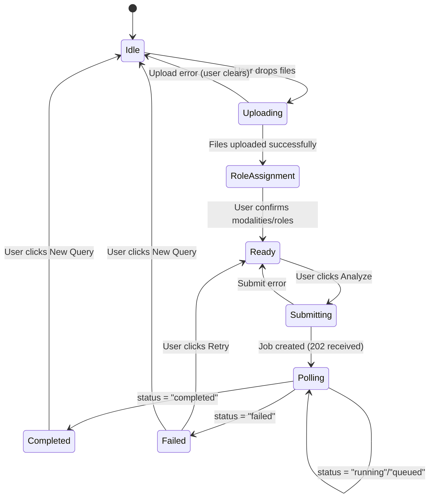
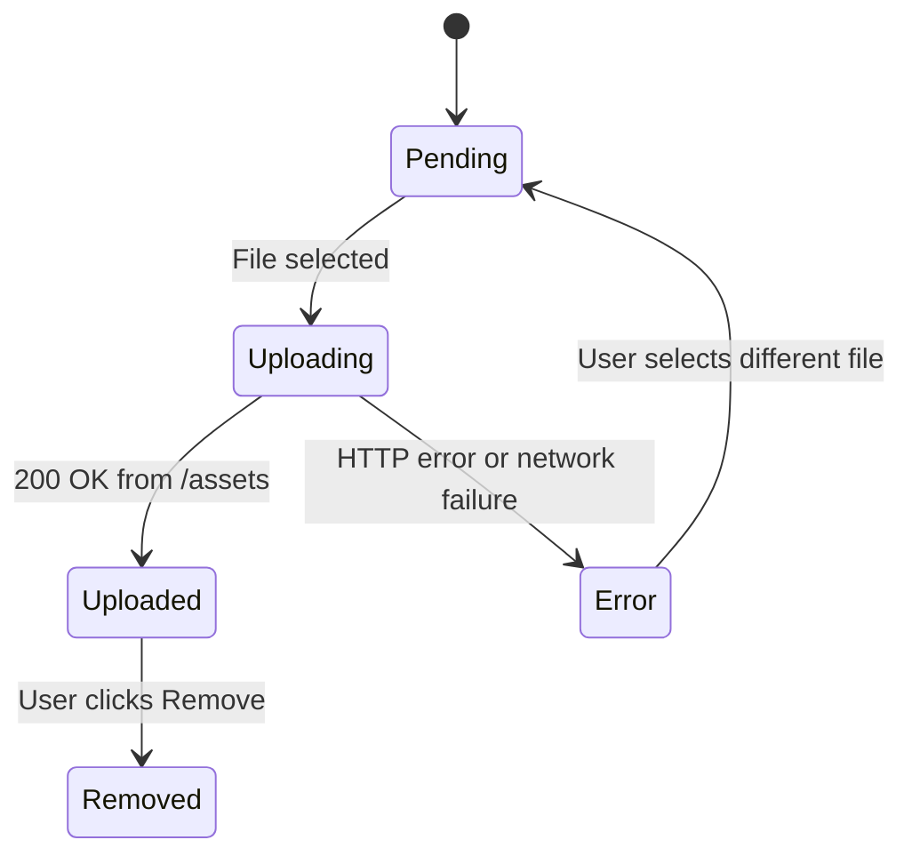
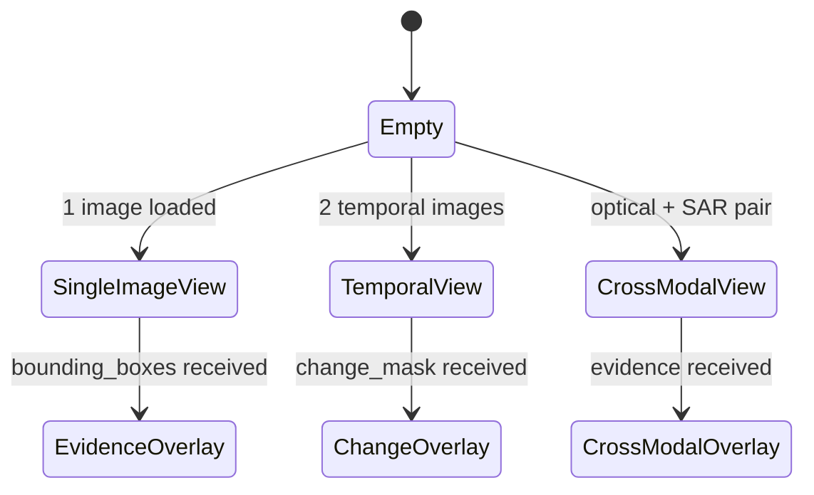

# SatQuery AI — Frontend Software Requirements Specification

**Document Type:** Implementation-Ready Engineering Specification  
**Target Document Consumer:** Frontend Developer (AI Agent or Human)  
**Project:** SatQuery AI — National-Level Hackathon (Smart India Hackathon)  
**Repository:** https://github.com/HEAVENLYBEING112/satquery-ai  
**Frontend Branch:** `feat/frontend`  
**Engine Branch:** `feat/engine-core` (FROZEN at commit `93fbaf1`)  
**SRS Version:** 2.0 (Forensic Audit Edition)  
**Date:** 2026-09-01

---

## Revision History

| Version | Date | Author | Summary |
|---|---|---|---|
| 1.0 | 2026-09-01 | Project Lead | Initial draft |
| 2.0 | 2026-09-01 | Principal Architect | Complete rewrite based on forensic source audit. All contracts verified against actual Python source. |

---

## Table of Contents

1. Executive Summary
2. Project Context
3. Scope & Boundaries
4. Stakeholders
5. Personas
6. Functional Requirements
7. Non-Functional Requirements
8. Engine V1 Forensic Audit
9. Engine Contract Extraction
10. Unresolved Architectural Decisions (with Resolutions)
11. API Contract Design
12. TypeScript Data Models
13. Frontend Architecture
14. Technology Decision
15. Information Architecture
16. Application State Machines
17. UX Specification
18. UI Design System
19. Upload System
20. Query System
21. Job Lifecycle
22. Result System
23. Evidence System
24. Image Viewer Specification
25. Temporal Comparison Viewer
26. Cross-Modal Viewer
27. Execution Trace Panel
28. Confidence Display
29. Fallback Display
30. Component Specifications
31. Accessibility
32. Performance
33. Security
34. Mock Development Mode
35. Testing Strategy
36. Acceptance Criteria (90+)
37. Deployment
38. Git Workflow
39. Merge Contract
40. Risks & Mitigations
41. Implementation Roadmap
42. Glossary
43. References

---

## 1. Executive Summary

SatQuery AI is a national-level hackathon remote-sensing analysis system. The backend Engine V1 is complete and frozen. This document specifies the complete implementation contract for a React-based frontend that communicates with a FastAPI backend, which wraps the engine. 

The developer who reads this document must be able to build, test, and deliver a complete, merge-ready frontend without any additional architectural decisions from the project lead.

**Key constraint:** The frontend is a pure presentation and interaction layer. It performs zero geospatial computation. All scientific analysis — task routing, model selection, evidence generation, fallback logic — is owned by the Engine V1. The frontend's job is to collect inputs, submit jobs, poll for results, and display structured evidence truthfully.

---

## 2. Project Context

SatQuery AI allows users to upload remote-sensing satellite imagery and query it in natural language. The system supports:

- **Single optical image queries** (VQA, captioning, grounding)
- **Temporal pair analysis** (change detection, change description)
- **Cross-modal optical + SAR analysis** (water/built-up classification via CROMA or deterministic baseline)

The system runs on a **low-spec laptop**. Performance must be carefully managed. The frontend must never attempt to decode or process GeoTIFF binary data directly in the browser.

---

## 3. Scope & Boundaries

**In scope (frontend owns):**
- `frontend/` directory
- All UI components, pages, state stores
- API client layer under `frontend/src/api/`
- TypeScript type definitions mirroring backend JSON schemas
- Mock API mode for development without a running backend

**Out of scope (frontend must NOT touch):**
- `engine/` directory (frozen — do not import, modify, or depend on)
- `backend/` directory (communicate via HTTP only)
- `tests/` at root (Python engine tests — separate concern)
- Any model weight files

---

## 4. Stakeholders

| Role | Concern |
|---|---|
| Project Lead | Architectural coherence, SIH compliance |
| Frontend Developer | This SRS is their complete spec |
| Backend Developer | The API contract in Section 11 is their contract |
| SIH Judges | End-to-end demo must be flawless and scientifically honest |
| Remote-sensing domain evaluators | Evidence must be correctly labeled; no fabricated metrics |

---

## 5. Personas

### 5.1 Remote-Sensing Expert (Primary)
**Background:** ISRO/SAC analyst, understands Sentinel-2, SAR backscatter, CRS.  
**Goals:** Extract exact bounding box coordinates, understand which model ran, verify the execution trace.  
**Pain Points:** Black-box AI that hides its process; fabricated confidence values.  
**UI Requirements:** Visible execution trace, exact bounding box coordinates, model name, fallback disclosure.

### 5.2 Disaster Management Analyst
**Background:** State government, moderate technical literacy.  
**Goals:** Upload flood-period images, identify inundated zones quickly.  
**Pain Points:** Complex GIS tool setup; slow interfaces.  
**UI Requirements:** Clear visual overlay of detected zones, simple one-query workflow, fast response.

### 5.3 Agricultural Analyst
**Background:** Moderate GIS background, familiar with NDVI.  
**Goals:** Compare seasonal imagery, detect crop change.  
**Pain Points:** Difficult temporal pair setup.  
**UI Requirements:** Clear BEFORE/AFTER labeling, change statistics summary.

### 5.4 Infrastructure/Urban Planner
**Background:** Low-to-moderate RS background.  
**Goals:** Detect new construction using optical + SAR fusion.  
**Pain Points:** Doesn't know the difference between optical and SAR.  
**UI Requirements:** The UI must clearly explain what each modality contributes, and what CROMA fallback means.

### 5.5 SIH Judge / Evaluator
**Background:** Varies. May be a domain expert or a technical evaluator.  
**Goals:** Assess the quality, honesty, and engineering of the submission.  
**Pain Points:** Fabricated outputs; broken demo; unexplained AI claims.  
**UI Requirements:** Every piece of evidence must be sourced; fallback must be visible; confidence null must be displayed as-is.

---

## 6. Functional Requirements

| ID | Requirement |
|---|---|
| FR-01 | User can upload 1 image (optical/SAR) |
| FR-02 | User can upload 2 images as temporal pair |
| FR-03 | User can upload 2 images as optical + SAR pair |
| FR-04 | User can assign modality (optical/SAR) per image |
| FR-05 | User can assign role (before/after) for temporal pairs |
| FR-06 | User can enter a free-text natural language query |
| FR-07 | System suggests example queries based on upload configuration |
| FR-08 | System validates file extension before submission |
| FR-09 | User can submit the analysis job |
| FR-10 | System displays job status in real time via polling |
| FR-11 | System displays the complete EngineResult when job completes |
| FR-12 | System renders bounding boxes over the source image |
| FR-13 | System renders change masks for temporal results |
| FR-14 | System displays temporal before/after comparison |
| FR-15 | System displays optical vs SAR layer toggle for cross-modal results |
| FR-16 | System displays the execution trace as a readable panel |
| FR-17 | System displays confidence as-is (including null) |
| FR-18 | System displays a fallback warning if `fallback_triggered` is true |
| FR-19 | User can download the analysis report |
| FR-20 | User can clear results and start a new query |
| FR-21 | Mock mode provides full UI workflow without a running backend |

---

## 7. Non-Functional Requirements

| ID | Requirement | Target |
|---|---|---|
| NFR-01 | Initial page load | < 3s on 4G / local |
| NFR-02 | UI interactivity after load | < 100ms response to user action |
| NFR-03 | Polling interval | 2000ms, not configurable by user |
| NFR-04 | Max upload size | 50MB per file (enforced by backend; frontend warns at 40MB) |
| NFR-05 | Browser memory for viewer | Must not load entire raw GeoTIFF binary into JS heap |
| NFR-06 | Accessibility | WCAG 2.1 AA |
| NFR-07 | Responsive | Desktop-primary (1080p+), tablet-graceful |
| NFR-08 | Security | No XSS, no dangerouslySetInnerHTML on user/engine content |
| NFR-09 | Scientific honesty | Never substitute null confidence with a number |
| NFR-10 | Mock mode | Full workflow runnable without backend in < 10s |

---

## 8. Engine V1 Forensic Audit

The following was determined by reading actual source code. **Do not rely on previous documentation.**

### 8.1 Entry Point
```python
# engine/core.py
class SatQueryEngine:
    def analyze(self, inputs: InputBundle, query: str) -> EngineResult
```
The backend wraps this method. The frontend never calls it directly.

### 8.2 TaskType Enum (engine/contracts.py lines 6–14)
```python
class TaskType(str, Enum):
    SINGLE_IMAGE_VQA        = "single_image_vqa"
    SINGLE_IMAGE_CAPTION    = "single_image_caption"
    SINGLE_IMAGE_GROUNDING  = "single_image_grounding"
    TEMPORAL_CHANGE_DETECTION    = "temporal_change_detection"
    TEMPORAL_CHANGE_DESCRIPTION  = "temporal_change_description"
    TEMPORAL_CHANGE_VQA          = "temporal_change_vqa"
    CROSS_MODAL_OPTICAL_SAR      = "cross_modal_optical_sar"
    CROMA_CLASSIFICATION         = "croma_classification"
```

### 8.3 InputType Enum (lines 16–22)
```python
class InputType(str, Enum):
    SINGLE_OPTICAL       = "single_optical"
    SINGLE_MULTISPECTRAL = "single_multispectral"
    SINGLE_SAR           = "single_sar"
    TEMPORAL_OPTICAL     = "temporal_optical"
    TEMPORAL_SAR         = "temporal_sar"
    OPTICAL_SAR_PAIR     = "optical_sar_pair"
```

### 8.4 ImageAsset (lines 24–38)
All fields except `id`, `path`, `filename`, `format`, `modality` are **Optional**.
```python
@dataclass
class ImageAsset:
    id: str                           # REQUIRED
    path: str                         # REQUIRED (server-side path)
    filename: str                     # REQUIRED
    format: str                       # REQUIRED (e.g. "GeoTIFF")
    modality: str                     # REQUIRED (e.g. "optical", "sar")
    width: Optional[int]              # from rasterio metadata
    height: Optional[int]
    bands: Optional[int]
    crs: Optional[str]
    resolution: Optional[float]
    acquisition_time: Optional[str]   # ISO 8601
    bbox: Optional[List[float]]       # [minx, miny, maxx, maxy]
    metadata: Dict[str, Any]
```

### 8.5 BoundingBox (lines 136–141)
```python
@dataclass
class BoundingBox:
    label: str                       # REQUIRED — e.g. "water_agreement"
    coordinates: List[float]         # REQUIRED — [xmin, ymin, xmax, ymax] PIXEL coords
    confidence: Optional[float]      # NULLABLE
    source: str                      # default "model"; actual values: "optical", "sar", "cross_modal", "croma_classifier"
```
> **CRITICAL NOTE:** Coordinates from `OpticalSARSpecialist` are **pixel coordinates** (`xmin, ymin, xmax, ymax` in pixel space), NOT geographic coordinates. From `CROMASpecialist`, if `opt_img.bbox` is available, they are **geographic** `[minx, miny, maxx, maxy]`. The frontend cannot assume one format. The backend must normalize this discrepancy before sending to the frontend.

### 8.6 ChangeMask (lines 143–150)
```python
@dataclass
class ChangeMask:
    width: int
    height: int
    mask_path: Optional[str]         # server-side file path — NOT a URL
    threshold_used: Optional[float]
    changed_pixel_count: int         # default 0
    changed_fraction: float          # default 0.0
```
> The `mask_path` is a server filesystem path. The backend must convert this to a URL before including in the API response.

### 8.7 EvidenceBundle (lines 152–159)
```python
@dataclass
class EvidenceBundle:
    textual_evidence: Optional[str]
    bounding_boxes: List[BoundingBox]    # may be empty
    visualizations: List[str]           # server filesystem paths — backend must convert to URLs
    change_statistics: Optional[Dict[str, Any]]
    change_mask: Optional[ChangeMask]
    metadata: Dict[str, Any]            # may contain "fallback_triggered": True
```

**Known metadata keys from actual code:**
- From `OpticalSARSpecialist`: `optical_water_pixels`, `sar_water_pixels`, `water_agreement_pixels`, `water_disagreement_pixels`
- From `CROMASpecialist` (success): `model`, `optical_bands_used`, `sar_bands_used`, `embedding_shape`, `device`, `head_trained`, `predicted_class`, `confidence`
- From CROMA fallback: `fallback_triggered: True`, `fallback_reason: "CROMA hardware/dependencies unavailable"` or `"CROMA classifier head missing"`

### 8.8 SpecialistResult (lines 161–171)
```python
@dataclass
class SpecialistResult:
    status: str                      # "success" | "error"
    model_name: str                  # e.g. "optical_sar_specialist", "croma_specialist", "baseline_change_detector"
    task: TaskType
    answer: Any                      # usually a string
    confidence: Optional[float]      # NULLABLE — preserved as null
    evidence: EvidenceBundle
    metadata: Dict[str, Any]
    execution_time: float            # seconds
    error: Optional[str]
```

### 8.9 EngineError (lines 173–176)
```python
@dataclass
class EngineError:
    code: str     # e.g. "PLANNING_FAILED", "INVALID_WORKFLOW", "NO_COMPATIBLE_TOOL", "MODEL_EXECUTION_FAILED"
    message: str
```

**Known error codes from actual source:**
- `PLANNING_FAILED` — planner could not route the query
- `INVALID_WORKFLOW` — validator rejected the plan  
- `NO_COMPATIBLE_TOOL` — tool not found in registry
- `UNSUPPORTED_TASK` — tool cannot run the task
- `MODEL_EXECUTION_FAILED` — model threw an exception
- `INTERNAL_ENGINE_ERROR` — unexpected error

### 8.10 EngineResult (lines 178–189)
```python
@dataclass
class EngineResult:
    request_id: str                           # UUID generated by SatQueryEngine
    status: str                               # "success" | "failed"
    query: str
    task: Optional[TaskType]                  # None if planning failed
    answer: Any                               # final answer string or None
    confidence: Optional[float]              # NULLABLE — None if no specialist returned confidence
    specialist_results: List[SpecialistResult]
    evidence: List[EvidenceBundle]           # one per specialist step executed
    execution_trace: List[Dict[str, Any]]    # one dict per workflow step
    errors: List[EngineError]                # empty on success
```

**Execution trace dict keys** (verified from executor.py lines 87–95):
```python
{
    "step": int,           # 1-based step index
    "tool": str,           # tool name, e.g. "baseline_change_detector"
    "task": str,           # TaskType value string
    "status": str,         # "success" | "error"
    "parameters": dict,    # step parameters
    "duration_ms": int,    # milliseconds
    "result_summary": Any  # the answer from that step
}
```

### 8.11 Confidence Semantics (verified from executor.py lines 84–104)
- If all specialist results return `confidence=None`, `EngineResult.confidence` is `None`.
- If any specialist returns a float confidence, `EngineResult.confidence` = `min(all non-null confidences)`.
- `confidence=1.0` only occurs if at least one specialist explicitly returned `1.0`.
- CROMA (when weights available) returns actual `softmax` probability — this is a genuine probability.
- All mock models return `confidence=None`.
- `OpticalSARSpecialist` returns `confidence=None`.

### 8.12 Planner Routing Logic (verified from planner.py)

| Input Configuration | Query Keywords | Routed Task |
|---|---|---|
| 1 optical image | "describe" | SINGLE_IMAGE_CAPTION |
| 1 optical image | "highlight", "ground" | SINGLE_IMAGE_GROUNDING |
| 1 optical image | "visible", "what is", or default | SINGLE_IMAGE_VQA |
| 2 optical images | "chang" + "what"/"describe" | TEMPORAL_CHANGE_DESCRIPTION (2 steps) |
| 2 optical images | "chang" (only) | TEMPORAL_CHANGE_DETECTION |
| 2 optical images | other queries | TEMPORAL_CHANGE_VQA (2 steps) |
| optical + SAR | "classify", "land-cover", "identify water" | CROMA_CLASSIFICATION |
| optical + SAR | other queries | CROSS_MODAL_OPTICAL_SAR |

**This table is critical for the Query Interface's suggested queries feature.**

---

## 9. Engine Contract Extraction

### 9.1 Field Mapping Table

| Engine Python Field | Type | Nullable | API JSON Field | TS Type |
|---|---|---|---|---|
| `EngineResult.request_id` | str | No | `request_id` | `string` |
| `EngineResult.status` | str | No | `status` | `"success" \| "failed"` |
| `EngineResult.query` | str | No | `query` | `string` |
| `EngineResult.task` | TaskType? | Yes | `task` | `TaskType \| null` |
| `EngineResult.answer` | Any | Yes | `answer` | `string \| null` |
| `EngineResult.confidence` | float? | Yes | `confidence` | `number \| null` |
| `EngineResult.specialist_results` | List | No | `specialist_results` | `SpecialistResult[]` |
| `EngineResult.evidence` | List | No | `evidence` | `EvidenceBundle[]` |
| `EngineResult.execution_trace` | List[Dict] | No | `execution_trace` | `TraceStep[]` |
| `EngineResult.errors` | List | No | `errors` | `EngineError[]` |
| `EvidenceBundle.textual_evidence` | str? | Yes | `textual_evidence` | `string \| null` |
| `EvidenceBundle.bounding_boxes` | List | No | `bounding_boxes` | `BoundingBox[]` |
| `EvidenceBundle.visualizations` | List[str] | No | `visualizations` | `string[]` (URLs) |
| `EvidenceBundle.change_statistics` | Dict? | Yes | `change_statistics` | `Record<string,any> \| null` |
| `EvidenceBundle.change_mask` | ChangeMask? | Yes | `change_mask` | `ChangeMask \| null` |
| `EvidenceBundle.metadata` | Dict | No | `metadata` | `Record<string,any>` |
| `BoundingBox.label` | str | No | `label` | `string` |
| `BoundingBox.coordinates` | List[float] | No | `coordinates` | `number[]` |
| `BoundingBox.confidence` | float? | Yes | `confidence` | `number \| null` |
| `BoundingBox.source` | str | No | `source` | `string` |
| `ChangeMask.width` | int | No | `width` | `number` |
| `ChangeMask.height` | int | No | `height` | `number` |
| `ChangeMask.mask_path` | str? | Yes | `mask_url` | `string \| null` (URL, converted by backend) |
| `ChangeMask.threshold_used` | float? | Yes | `threshold_used` | `number \| null` |
| `ChangeMask.changed_pixel_count` | int | No | `changed_pixel_count` | `number` |
| `ChangeMask.changed_fraction` | float | No | `changed_fraction` | `number` |

---

## 10. Unresolved Architectural Decisions (with Resolutions)

Every integration ambiguity has been evaluated and resolved here. The developer must not re-open these decisions.

### 10.1 Upload API Design
**Ambiguity:** Should file upload be multipart with the query, or a two-step upload-then-submit?  
**Decision:** **Two-step.**  
1. `POST /api/v1/assets` — upload files, get asset IDs back.  
2. `POST /api/v1/jobs` — submit job with asset IDs and query.  
**Rationale:** Decouples upload latency from analysis submission. Allows the UI to show upload progress then query box. Also allows retrying analysis on same images without re-uploading.

### 10.2 Modality Assignment
**Ambiguity:** Who decides if an uploaded file is "optical" or "SAR"?  
**Decision:** The **frontend requires user confirmation.** After upload, if 2 files are uploaded, the UI must present a "Assign Roles" step where the user explicitly tags each file as optical/SAR or before/after.  
**Rationale:** The backend cannot reliably determine modality from a TIFF header. The user knows what they uploaded.

### 10.3 Job Polling
**Ambiguity:** Push (WebSocket) vs Pull (polling)?  
**Decision:** **Polling at 2000ms intervals.**  
**Rationale:** WebSocket adds infrastructure complexity inappropriate for a hackathon backend that may be a single Uvicorn process.

### 10.4 Visualization URLs
**Ambiguity:** `EvidenceBundle.visualizations` contains filesystem paths (e.g., `outputs/cross_modal_vis_1234.png`). How do these become URLs?  
**Decision:** The backend must serve `runtime/jobs/{job_id}/output/` as a static files route (FastAPI `StaticFiles`) and rewrite `visualizations` paths to `GET /api/v1/jobs/{job_id}/evidence/{filename}`.  
The frontend treats `visualizations` as a list of absolute URLs ready to use in `` tags.

### 10.5 ChangeMask Serving
**Ambiguity:** `ChangeMask.mask_path` is a server path, not a URL.  
**Decision:** Same as 10.4. Backend rewrites `mask_path` to a URL. Frontend treats `change_mask.mask_url` as an absolute URL.

### 10.6 BoundingBox Coordinate System
**Ambiguity:** Coordinates may be pixel-space or geographic depending on which specialist ran.  
**Decision:** The backend must include a `coordinate_type` field in the serialized BoundingBox: `"pixel"` or `"geo"`. The viewer uses this to determine whether to place boxes in image-pixel space or map-coordinate space.

### 10.7 History
**Ambiguity:** Should the app have a history of past queries?  
**Decision:** **Local storage only for MVP.** Store up to 10 past `job_id` values and their query strings in `localStorage`. No backend history endpoint required.

### 10.8 Authentication
**Decision:** None for MVP. The application assumes trusted local network deployment during the hackathon.

### 10.9 Report Format
**Decision:** JSON report for MVP. The backend returns `GET /api/v1/jobs/{job_id}/report` as `application/json`. The frontend triggers a browser download of this file.

### 10.10 Progress Reporting
**Decision:** No fake percentages. The UI shows an indeterminate spinner with text `"Analyzing..."` until the backend returns a completed or failed status. If the backend ever returns a `progress` field in the job status, it will be displayed, but the frontend must not assume this field exists.

---

## 11. API Contract Design

The following is the canonical contract that the backend must implement and the frontend must consume.

### 11.1 POST /api/v1/assets — Upload Image

**Request:**
```
Content-Type: multipart/form-data
Field: file (binary)
```

**Success Response (200):**
```json
{
  "asset_id": "uuid-v4",
  "filename": "sentinel2_flood.tif",
  "size_bytes": 4194304,
  "format": "GeoTIFF",
  "width": 512,
  "height": 512,
  "bands": 3,
  "crs": "EPSG:4326",
  "resolution": 10.0,
  "bbox": [77.1, 12.9, 77.5, 13.2]
}
```
Fields `width`, `height`, `bands`, `crs`, `resolution`, `bbox` may be null if rasterio cannot parse them.

**Error Response (400):**
```json
{
  "code": "UNSUPPORTED_FORMAT",
  "message": "File must be a GeoTIFF (.tif or .tiff).",
  "details": null
}
```

**Error Response (413):**
```json
{
  "code": "UPLOAD_TOO_LARGE",
  "message": "File exceeds maximum allowed size of 50MB.",
  "details": null
}
```

### 11.2 POST /api/v1/jobs — Submit Analysis Job

**Request:**
```json
{
  "query": "What changed between these two dates?",
  "assets": [
    {
      "asset_id": "uuid-1",
      "modality": "optical",
      "role": "before",
      "acquisition_time": "2024-01-15T10:30:00Z"
    },
    {
      "asset_id": "uuid-2",
      "modality": "optical",
      "role": "after",
      "acquisition_time": "2024-08-10T10:30:00Z"
    }
  ]
}
```
Fields `role` and `acquisition_time` are optional. If provided, they inform the engine's `before`/`after` ordering.

**Success Response (202):**
```json
{
  "job_id": "uuid-v4",
  "status": "queued",
  "created_at": "2026-09-01T14:00:00Z"
}
```

### 11.3 GET /api/v1/jobs/{job_id} — Poll Job Status

**Response while running (200):**
```json
{
  "job_id": "uuid-v4",
  "status": "running",
  "created_at": "2026-09-01T14:00:00Z",
  "updated_at": "2026-09-01T14:00:05Z",
  "result": null
}
```

**Response on completion (200):**
```json
{
  "job_id": "uuid-v4",
  "status": "completed",
  "created_at": "2026-09-01T14:00:00Z",
  "updated_at": "2026-09-01T14:00:18Z",
  "result": { /* EngineResult — see Section 11.5 */ }
}
```

**Response on failure (200):**
```json
{
  "job_id": "uuid-v4",
  "status": "failed",
  "created_at": "2026-09-01T14:00:00Z",
  "updated_at": "2026-09-01T14:00:06Z",
  "result": {
    "request_id": "uuid",
    "status": "failed",
    "query": "...",
    "task": null,
    "answer": null,
    "confidence": null,
    "specialist_results": [],
    "evidence": [],
    "execution_trace": [],
    "errors": [
      { "code": "PLANNING_FAILED", "message": "Temporal queries require 2 images." }
    ]
  }
}
```

**Job not found (404):**
```json
{
  "code": "JOB_NOT_FOUND",
  "message": "Job uuid-v4 does not exist.",
  "details": null
}
```

### 11.4 GET /api/v1/jobs/{job_id}/trace — Execution Trace

Returns only the execution trace for display in the trace panel.
```json
{
  "job_id": "uuid",
  "trace": [
    {
      "step": 1,
      "tool": "baseline_change_detector",
      "task": "temporal_change_detection",
      "status": "success",
      "parameters": {},
      "duration_ms": 412,
      "result_summary": "Detected 3 changed regions."
    },
    {
      "step": 2,
      "tool": "mock_change_description",
      "task": "temporal_change_description",
      "status": "success",
      "parameters": { "change_statistics": { "changed_pixels": 1200 } },
      "duration_ms": 88,
      "result_summary": "Change described."
    }
  ]
}
```

### 11.5 Full EngineResult JSON Example (success)

```json
{
  "request_id": "550e8400-e29b-41d4-a716-446655440000",
  "status": "success",
  "query": "What changed between these two dates?",
  "task": "temporal_change_description",
  "answer": "The analysis detected significant change. Vegetation loss observed in the northern sector.",
  "confidence": null,
  "specialist_results": [
    {
      "status": "success",
      "model_name": "baseline_change_detector",
      "task": "temporal_change_detection",
      "answer": "3 changed regions detected.",
      "confidence": null,
      "evidence": {
        "textual_evidence": "Pixel difference analysis complete.",
        "bounding_boxes": [
          {
            "label": "changed_region",
            "coordinates": [45, 30, 120, 85],
            "coordinate_type": "pixel",
            "confidence": null,
            "source": "baseline_change_detector"
          }
        ],
        "visualizations": [
          "/api/v1/jobs/uuid/evidence/change_vis.png"
        ],
        "change_statistics": {
          "changed_pixels": 1247,
          "changed_fraction": 0.124,
          "threshold_used": 0.2
        },
        "change_mask": {
          "width": 100,
          "height": 100,
          "mask_url": "/api/v1/jobs/uuid/evidence/change_mask.png",
          "threshold_used": 0.2,
          "changed_pixel_count": 1247,
          "changed_fraction": 0.124
        },
        "metadata": {}
      },
      "metadata": {},
      "execution_time": 0.412
    }
  ],
  "evidence": [ /* same EvidenceBundles as within specialist_results */ ],
  "execution_trace": [
    {
      "step": 1,
      "tool": "baseline_change_detector",
      "task": "temporal_change_detection",
      "status": "success",
      "parameters": {},
      "duration_ms": 412,
      "result_summary": "3 changed regions detected."
    }
  ],
  "errors": []
}
```

### 11.6 GET /api/v1/jobs/{job_id}/report — Download Report (200, application/json)

### 11.7 GET /api/v1/jobs/{job_id}/evidence/{filename} — Serve Evidence File (200, image/png)

### 11.8 GET /api/v1/health

```json
{
  "status": "healthy",
  "version": "1.0.0",
  "engine_mode": "mock",
  "timestamp": "2026-09-01T14:00:00Z"
}
```

### 11.9 GET /api/v1/capabilities

```json
{
  "tasks": [
    "single_image_vqa",
    "single_image_caption",
    "single_image_grounding",
    "temporal_change_detection",
    "temporal_change_description",
    "temporal_change_vqa",
    "cross_modal_optical_sar",
    "croma_classification"
  ],
  "input_types": [
    "single_optical",
    "single_multispectral",
    "single_sar",
    "temporal_optical",
    "temporal_sar",
    "optical_sar_pair"
  ],
  "supported_formats": ["GeoTIFF"],
  "max_upload_bytes": 52428800,
  "models": {
    "mock": ["MockVQA", "MockGrounding", "MockCaptioner", "baseline_change_detector", "optical_sar_specialist"],
    "real": ["remote_sensing_vqa", "remote_sensing_grounding", "croma_specialist"]
  }
}
```

---

## 12. TypeScript Data Models

These must be placed in `frontend/src/types/engine.ts`. Every field is verified against actual Python dataclasses in `engine/contracts.py`.

```typescript
// frontend/src/types/engine.ts

export type TaskType =
  | "single_image_vqa"
  | "single_image_caption"
  | "single_image_grounding"
  | "temporal_change_detection"
  | "temporal_change_description"
  | "temporal_change_vqa"
  | "cross_modal_optical_sar"
  | "croma_classification";

export type InputType =
  | "single_optical"
  | "single_multispectral"
  | "single_sar"
  | "temporal_optical"
  | "temporal_sar"
  | "optical_sar_pair";

export type JobStatus =
  | "queued"
  | "running"
  | "completed"
  | "failed"
  | "cancelled";

export type Modality = "optical" | "sar";
export type Role = "before" | "after";
export type CoordinateType = "pixel" | "geo";

export interface BoundingBox {
  label: string;                    // e.g. "water_agreement", "changed_region"
  coordinates: [number, number, number, number]; // [xmin, ymin, xmax, ymax]
  coordinate_type: CoordinateType;  // added by backend
  confidence: number | null;
  source: string;                   // "optical" | "sar" | "cross_modal" | "croma_classifier" | "model"
}

export interface ChangeMask {
  width: number;
  height: number;
  mask_url: string | null;          // backend converts mask_path to URL
  threshold_used: number | null;
  changed_pixel_count: number;
  changed_fraction: number;
}

export interface EvidenceBundle {
  textual_evidence: string | null;
  bounding_boxes: BoundingBox[];
  visualizations: string[];         // list of fully-qualified URLs
  change_statistics: Record<string, unknown> | null;
  change_mask: ChangeMask | null;
  metadata: Record<string, unknown>; // may contain fallback_triggered, fallback_reason
}

export interface EngineError {
  code: string;   // "PLANNING_FAILED" | "INVALID_WORKFLOW" | "MODEL_EXECUTION_FAILED" | etc.
  message: string;
}

export interface TraceStep {
  step: number;
  tool: string;
  task: string;
  status: string;
  parameters: Record<string, unknown>;
  duration_ms: number;
  result_summary: unknown;
}

export interface SpecialistResult {
  status: string;
  model_name: string;
  task: TaskType;
  answer: string | null;
  confidence: number | null;        // nullable — NEVER replace with 0 or 1
  evidence: EvidenceBundle;
  metadata: Record<string, unknown>;
  execution_time: number;           // seconds
  error: string | null;
}

export interface EngineResult {
  request_id: string;
  status: "success" | "failed";
  query: string;
  task: TaskType | null;
  answer: string | null;
  confidence: number | null;        // nullable — NEVER replace with any default
  specialist_results: SpecialistResult[];
  evidence: EvidenceBundle[];
  execution_trace: TraceStep[];
  errors: EngineError[];
}

// API-level types
export interface AssetUploadResponse {
  asset_id: string;
  filename: string;
  size_bytes: number;
  format: string;
  width: number | null;
  height: number | null;
  bands: number | null;
  crs: string | null;
  resolution: number | null;
  bbox: [number, number, number, number] | null;
}

export interface JobSubmitRequest {
  query: string;
  assets: Array<{
    asset_id: string;
    modality: Modality;
    role?: Role;
    acquisition_time?: string;
  }>;
}

export interface JobResponse {
  job_id: string;
  status: JobStatus;
  created_at: string;
  updated_at: string;
  result: EngineResult | null;
}

export interface ApiError {
  code: string;
  message: string;
  details: unknown;
}
```

---

## 13. Frontend Architecture

```
frontend/
├── public/
│   └── satquery-logo.svg
├── src/
│   ├── main.tsx                    # Vite entry point
│   ├── App.tsx                     # Root layout and routing
│   │
│   ├── api/
│   │   ├── client.ts              # Axios instance, base URL, error interceptor
│   │   ├── assets.ts              # uploadAsset()
│   │   ├── jobs.ts                # submitJob(), pollJob(), getTrace(), getReport()
│   │   ├── system.ts              # health(), capabilities()
│   │   └── mock/
│   │       ├── mockData.ts        # Hardcoded deterministic EngineResult fixtures
│   │       └── mockService.ts     # Mock implementations of all api/* functions
│   │
│   ├── types/
│   │   └── engine.ts              # All TypeScript interfaces (Section 12)
│   │
│   ├── store/
│   │   └── useAppStore.ts         # Zustand global store
│   │
│   ├── hooks/
│   │   ├── useJobPoller.ts        # Polling logic with cleanup
│   │   └── useFileUpload.ts       # Upload orchestration hook
│   │
│   ├── components/
│   │   ├── layout/
│   │   │   ├── AppHeader.tsx
│   │   │   └── AppLayout.tsx
│   │   │
│   │   ├── upload/
│   │   │   ├── DropZone.tsx
│   │   │   ├── AssetCard.tsx
│   │   │   ├── RoleAssignment.tsx
│   │   │   └── ModalityBadge.tsx
│   │   │
│   │   ├── query/
│   │   │   ├── QueryInput.tsx
│   │   │   ├── QuerySuggestions.tsx
│   │   │   └── SubmitButton.tsx
│   │   │
│   │   ├── status/
│   │   │   ├── JobStatusBar.tsx
│   │   │   └── ProgressSpinner.tsx
│   │   │
│   │   ├── results/
│   │   │   ├── ResultsPanel.tsx
│   │   │   ├── AnswerCard.tsx
│   │   │   ├── ConfidenceBadge.tsx
│   │   │   ├── FallbackAlert.tsx
│   │   │   ├── ErrorPanel.tsx
│   │   │   └── ChangeStatistics.tsx
│   │   │
│   │   ├── viewer/
│   │   │   ├── ImageViewer.tsx         # Base Leaflet viewer
│   │   │   ├── BoundingBoxOverlay.tsx  # Renders BoundingBox[]
│   │   │   ├── ChangeMaskOverlay.tsx   # Renders ChangeMask image overlay
│   │   │   ├── TemporalSlider.tsx      # Before/after split view
│   │   │   ├── CrossModalToggle.tsx    # Optical/SAR layer switch
│   │   │   └── ViewerLegend.tsx
│   │   │
│   │   ├── trace/
│   │   │   ├── TracePanel.tsx
│   │   │   └── TraceStep.tsx
│   │   │
│   │   └── ui/
│   │       ├── Badge.tsx
│   │       ├── Alert.tsx
│   │       ├── Card.tsx
│   │       ├── Button.tsx
│   │       ├── Spinner.tsx
│   │       ├── Tooltip.tsx
│   │       └── EmptyState.tsx
│   │
│   └── utils/
│       ├── formatters.ts          # Format confidence, dates, byte sizes
│       ├── taskLabels.ts          # Human-readable TaskType → label mapping
│       └── sanitize.ts            # Escape user/engine content for safe display
│
├── tests/
│   ├── unit/
│   ├── components/
│   └── integration/
│
├── .env
├── .env.example
├── vite.config.ts
├── tailwind.config.ts
├── tsconfig.json
└── package.json
```

---

## 14. Technology Decision

| Technology | Decision | Rationale |
|---|---|---|
| **React 18** | ✅ Selected | Dominant ecosystem, excellent library support for Leaflet and data viz. Team familiarity assumed. |
| **Vite** | ✅ Selected | Sub-second HMR on low-spec laptops. No SSR overhead. Ideal for SPA that uploads large local files and polls a Python backend. |
| **TypeScript** | ✅ Required | The `EngineResult` structure has 10+ nested nullable fields. Runtime type safety is non-negotiable for scientific honesty. |
| **Tailwind CSS** | ✅ Selected | Rapid UI construction without large CSS bundles. Utility-first works well for design systems with strict color semantics. |
| **Zustand** | ✅ Selected over Redux | Minimal boilerplate, excellent TypeScript support. Job state (upload → polling → result) maps naturally to a Zustand slice. |
| **React Leaflet** | ✅ Selected over OpenLayers | Lighter bundle, simpler React integration. The viewer only needs image overlays and vector boxes — no full GIS tile infrastructure needed. |
| **Axios** | ✅ Selected | Interceptors for error normalization, easy progress events for upload, broad ecosystem familiarity. |
| **Vitest + RTL** | ✅ Selected | Matches Vite ecosystem. React Testing Library ensures behavior-first testing. |
| **Next.js** | ❌ Rejected | SSR overhead unnecessary; complicates static `` overlay approach; slower dev server. |
| **Redux Toolkit** | ❌ Rejected | Excessive boilerplate for 4–5 state slices. Zustand achieves same result in 1/5 the code. |
| **MapLibre GL** | ❌ Rejected | Requires WebGL context management, tile server, and MVT data — unnecessary complexity for static image overlays. |

---

## 15. Information Architecture

```
/ (Analyzer — single page, tabbed sections)
  │
  ├── Upload Panel (left column)
  ├── Query Panel (left column, below upload)
  ├── Job Status Bar (center top, appears during processing)
  ├── Viewer Panel (center/right — main content area)
  │   ├── Single Image View
  │   ├── Temporal Split View (before/after)
  │   └── Cross-Modal Toggle View (optical/SAR)
  │
  ├── Results Panel (right/bottom)
  │   ├── Answer Card
  │   ├── Confidence Badge
  │   ├── Fallback Alert (conditional)
  │   ├── Evidence Summary
  │   └── Change Statistics (conditional)
  │
  └── Trace Panel (collapsible, bottom)

/history (local storage query history)
/help (modal or dedicated page with example queries and format requirements)
```

---

## 16. Application State Machines

### 16.1 Application State Machine



### 16.2 Upload State Machine (per file)



### 16.3 Viewer State Machine



---

## 17. UX Specification

### 17.1 Interaction Flows

**Flow A: Single Image VQA**
1. User drops 1 TIFF → DropZone shows preview thumbnail (PNG generated by backend after upload, or placeholder icon)
2. System auto-suggests: "What is visible?", "Describe the land cover", "Highlight the vegetation"
3. User types or selects query → clicks Analyze
4. Spinner appears. Status: "Analyzing..."
5. Result panel shows: Answer text, no bounding boxes (MockVQA returns empty EvidenceBundle)
6. Trace panel shows: 1 step (`MockVQA` or `remote_sensing_vqa`), duration

**Flow B: Temporal Change Detection**
1. User drops 2 TIFF files → RoleAssignment step appears
2. User tags each as BEFORE / AFTER (or sets acquisition date)
3. System suggests: "What changed between these two dates?"
4. Result panel shows: answer + change statistics + change mask overlay on viewer
5. Viewer shows temporal split: BEFORE left, AFTER right, change mask togglable

**Flow C: Cross-Modal Optical + SAR (Fallback Path)**
1. User drops 2 TIFFs → RoleAssignment shows OPTICAL / SAR options
2. User tags appropriately, submits query "Classify using SAR and optical"
3. Job runs. PyTorch unavailable on server → engine falls back to `OpticalSARSpecialist`
4. Result arrives. `evidence[-1].metadata.fallback_triggered === true`
5. **FallbackAlert renders with amber border**, message: "Advanced multimodal model unavailable. Result generated using deterministic cross-modal analysis fallback. Reason: CROMA hardware/dependencies unavailable."
6. Bounding boxes (water_agreement, built_agreement) are overlaid on the optical image

### 17.2 Scientific Honesty Rules (Non-Negotiable)
- If `confidence === null`: render `Confidence: N/A (No probabilistic estimate available)`
- If `fallback_triggered === true`: render the FallbackAlert — this MUST NOT be hidden
- If `answer === null`: render `No answer was generated`
- Never display model names that did not actually run (e.g., never say "CROMA" if fallback occurred)
- All bounding boxes must display their `source` label on hover

---

## 18. UI Design System

### 18.1 Color Palette

| Token | Value | Usage |
|---|---|---|
| `brand-primary` | `#4338ca` (Indigo-700) | Primary buttons, active states |
| `brand-surface` | `#f8fafc` (Slate-50) | Main background |
| `brand-panel` | `#ffffff` | Panel cards |
| `brand-border` | `#e2e8f0` (Slate-200) | Card borders |
| `text-primary` | `#0f172a` (Slate-900) | Body text |
| `text-secondary` | `#64748b` (Slate-500) | Labels, hints |
| `text-mono` | `#1e293b` (Slate-800) | Monospace (trace, coords) |
| `status-success` | `#16a34a` (Green-600) | Confidence high, success |
| `status-warning` | `#d97706` (Amber-600) | Fallback alerts |
| `status-error` | `#dc2626` (Red-600) | Errors, failed jobs |
| `status-info` | `#0369a1` (Sky-700) | Evidence labels |
| `bbox-water` | `#3b82f6` (Blue-500) | Water bounding boxes |
| `bbox-built` | `#f97316` (Orange-500) | Built-up bounding boxes |
| `bbox-change` | `#ef4444` (Red-500) | Changed region boxes |

### 18.2 Typography

| Style | Font | Size | Weight |
|---|---|---|---|
| Page Title | Inter | 20px | 700 |
| Panel Title | Inter | 14px | 600 |
| Body | Inter | 14px | 400 |
| Label | Inter | 12px | 500 |
| Hint | Inter | 11px | 400 |
| Mono/Code | Fira Code | 12px | 400 |
| Answer Text | Inter | 16px | 400 |

### 18.3 Spacing
Use Tailwind spacing scale: 4px base unit (p-1=4px, p-2=8px, p-4=16px, etc.)

### 18.4 Key Component States

**Button:**
- Default: `bg-indigo-700 text-white`
- Hover: `bg-indigo-800`
- Disabled: `bg-slate-300 text-slate-500 cursor-not-allowed`
- Loading: spinner icon left, text "Submitting..."

**ConfidenceBadge:**
- null: `bg-slate-100 text-slate-500 text-xs px-2 py-1 rounded-full` — "Confidence: N/A"
- ≥ 0.8: `bg-green-100 text-green-700`
- ≥ 0.5: `bg-yellow-100 text-yellow-700`
- < 0.5: `bg-red-100 text-red-700`

**FallbackAlert:**
```
bg-amber-50 border-l-4 border-amber-500 p-4 rounded-r-md
icon: ⚠️
title: "Fallback Model Activated" (font-semibold text-amber-800)
body: fallback_reason value (text-amber-700)
```

---

## 19. Upload System

### 19.1 DropZone Component

**Accepts:** `.tif`, `.tiff` only. Extension check in frontend (`file.name.endsWith('.tif') || file.name.endsWith('.tiff')`).

**Capacity:** 1 or 2 files maximum. If user drops a 3rd, show error: "Maximum 2 images per analysis."

**Behavior:**
- Drag over: `border-indigo-500 bg-indigo-50`
- Drop: trigger `useFileUpload` hook
- Each file upload is independent (separate `POST /api/v1/assets`)
- Shows upload progress bar per file
- On success: shows `AssetCard` with filename, size, detected metadata (bands, dimensions, CRS)
- On error: shows inline error with retry option

**Warning threshold:** If file > 40MB, show: "Large file — upload may take a moment."

### 19.2 RoleAssignment Component

Appears after 2 files are uploaded. Shows 2 `AssetCard` components side by side with a dropdown on each:

**For temporal pair (both same modality):**
- Dropdown: BEFORE / AFTER
- Optional: acquisition date picker

**For cross-modal pair (different modalities inferred by user):**
- Dropdown: OPTICAL / SAR
- Hint: "Optical images are multispectral (RGB, Sentinel-2). SAR images are from Sentinel-1 (VV/VH backscatter)."

**Validation:** Both must have different roles. Cannot assign "before/before" or "optical/optical" for cross-modal.

---

## 20. Query System

### 20.1 QueryInput Component

- `<textarea>` with `rows={3}` and auto-resize on content
- Placeholder: "Ask a question about your imagery..."
- Character limit: 500 (with counter)
- Keyboard shortcut: `Ctrl+Enter` submits

### 20.2 QuerySuggestions Component

Shows context-aware clickable suggestion pills based on upload configuration:

| Upload Configuration | Suggestions |
|---|---|
| No uploads | (hidden) |
| 1 optical image | "What is visible in this image?", "Describe the land cover.", "What is the dominant land use?" |
| 1 optical image | "Highlight the water body.", "Locate the built-up area." |
| 2 temporal optical | "What changed between these two dates?", "Describe the changes in detail.", "Has the built-up area increased?" |
| optical + SAR | "Classify using SAR and optical.", "Identify built-up and water-covered regions.", "Use both images to analyze land cover." |

### 20.3 Submit Logic

Submit is disabled if:
- No assets uploaded
- RoleAssignment not completed (if 2 assets present)
- Query string is empty or whitespace-only
- A job is currently running (re-entry blocked)

---

## 21. Job Lifecycle

### 21.1 Polling Implementation

```typescript
// src/hooks/useJobPoller.ts
const POLL_INTERVAL_MS = 2000;
const MAX_POLL_ATTEMPTS = 150; // 5 minutes maximum

function useJobPoller(jobId: string | null) {
  // On unmount or jobId change, clearInterval automatically
  // Stops when status is "completed" or "failed"
  // On maxAttempts exceeded: sets status to "timeout" with error message
}
```

### 21.2 Status Display Text

| Job Status | UI Display | Visual |
|---|---|---|
| `queued` | "Waiting for engine to be ready..." | Indeterminate progress bar |
| `running` | "Analyzing..." | Spinning icon |
| `completed` | (results render immediately) | Green check |
| `failed` | "Analysis failed" + error panel | Red X |
| `cancelled` | "Query was cancelled" | Grey |
| `timeout` | "Analysis timed out. Please retry." | Warning icon |

---

## 22. Result System

### 22.1 ResultsPanel Layout

When a job completes, the ResultsPanel renders:

```
┌─────────────────────────────────────────────────────┐
│ ANSWER                                              │
│ [AnswerCard with large text]                        │
│                                                     │
│ CONFIDENCE  [ConfidenceBadge]   TASK  [TaskBadge]  │
│                                                     │
│ [FallbackAlert — only if fallback_triggered]        │
│                                                     │
│ EVIDENCE                                            │
│ [textual_evidence as bullet points]                 │
│ [change_statistics table — if present]              │
│                                                     │
│ [Model Used: model_name from specialist_results[0]]│
│ [Execution Time: Xs]                                │
│                                                     │
│ [ Download Report ]  [ New Query ]                  │
└─────────────────────────────────────────────────────┘
```

### 22.2 AnswerCard

- Renders `EngineResult.answer` as plain text
- Escaped via `sanitize.ts` — no HTML rendering
- Empty state: "No answer was generated for this query."

### 22.3 ErrorPanel

If `EngineResult.status === "failed"`, renders instead of ResultsPanel:
```
Error: [EngineError.code]
[EngineError.message]
[Retry button → restores to Ready state with same query/assets]
```

---

## 23. Evidence System

### 23.1 Evidence rendering rules

`EngineResult.evidence` is a list. For multi-step workflows (e.g., change description), it contains one `EvidenceBundle` per specialist step.

- **Always show the last EvidenceBundle's textual_evidence** in the ResultsPanel (it represents the final output).
- **Bounding boxes from all steps** are merged and sent to the viewer.
- **Change mask from the first TEMPORAL_CHANGE_DETECTION step** is used for the viewer overlay.
- **Visualizations from all steps** are available as a gallery below the viewer.

### 23.2 Change Statistics Table

If `change_statistics` is not null, render as a key-value table:

```
| Metric | Value |
|---|---|
| Changed pixels | 1,247 |
| Changed fraction | 12.4% |
| Threshold used | 0.20 |
```

Known keys from `OpticalSARSpecialist`:
- `optical_water_pixels`, `sar_water_pixels`, `water_agreement_pixels`, `water_disagreement_pixels`

Known keys from `BaselineChangeDetector` (via `change_mask`):
- `changed_pixel_count`, `changed_fraction`, `threshold_used`

---

## 24. Image Viewer Specification

### 24.1 Technology

Use **React Leaflet** (`react-leaflet` + `leaflet`). 

The viewer does NOT use tile layers. It uses `L.imageOverlay` to place the uploaded image (served as PNG by backend via `/api/v1/jobs/{id}/evidence/preview_opt.png`) over a simple white canvas Leaflet map.

### 24.2 Core Capabilities

| Feature | Implementation |
|---|---|
| Pan | Leaflet default drag |
| Zoom | Leaflet scroll wheel + +/- buttons |
| Fit to image | `map.fitBounds(imageBounds)` on load |
| Reset view | Button → calls `map.fitBounds(imageBounds)` |
| Layer toggle | Leaflet `L.Control.Layers` for overlays |

### 24.3 BoundingBoxOverlay

- Uses `L.rectangle` for `coordinate_type === "geo"` (geographic bounds)
- Uses a scaled custom `L.rectangle` for `coordinate_type === "pixel"` (normalized to image dimensions)
- Tooltip on hover: `{BoundingBox.label} (source: {BoundingBox.source})`
- Color by label pattern:
  - label contains "water": blue
  - label contains "built": orange
  - label contains "change": red
  - other: indigo

### 24.4 ChangeMaskOverlay

- Uses `L.imageOverlay(change_mask.mask_url, imageBounds)` with opacity 0.5
- Toggle button in viewer legend: "Change Mask"
- Checkbox in `ViewerLegend` controls visibility

---

## 25. Temporal Comparison Viewer

Activated when: `task` is one of `temporal_change_detection`, `temporal_change_description`, `temporal_change_vqa`.

### 25.1 Split View

Two `ImageViewer` instances side-by-side:
- Left: BEFORE image preview URL
- Right: AFTER image preview URL
- Both synchronized zoom/pan via shared Leaflet `syncMaps` plugin or manual event bridging

### 25.2 Overlay Behavior

- Change mask overlays on BOTH panels simultaneously
- Bounding boxes from change detection appear on AFTER panel by default
- Toggle to show on BEFORE for comparison

### 25.3 Scientific Constraint

If only `ChangeMask.changed_fraction` and pixel counts are available (no semantic labels), the UI must display:

> "Statistical change detected. Semantic interpretation unavailable without trained classifier."

Do NOT label regions as "deforestation", "construction", etc. unless the engine explicitly returned those labels.

---

## 26. Cross-Modal Viewer

Activated when: `task` is `cross_modal_optical_sar` or `croma_classification`.

### 26.1 Layer Toggle

A toggle in the viewer header switches the base image between:
- **OPTICAL** — optical preview image
- **SAR** — SAR preview image

The toggle is a simple `<button>` with `Optical | SAR` options.

### 26.2 Evidence Display

All bounding boxes from all specialists are overlaid regardless of base layer:
- `source === "optical"`: blue border, dashed
- `source === "sar"`: orange border, dashed  
- `source === "cross_modal"`: solid green — cross-modal agreement regions

### 26.3 Modality Explanation Tooltip

An info icon (`ⓘ`) near the layer toggle expands a tooltip:
> "Optical imagery provides spectral/contextual information. SAR (Synthetic Aperture Radar) provides structural backscatter information through cloud cover. Cross-modal agreement regions (green) appear in both."

---

## 27. Execution Trace Panel

### 27.1 Location

Collapsible drawer at bottom of the app, always accessible via a "▲ Execution Trace" toggle button.

### 27.2 Content

Renders `EngineResult.execution_trace` (a `TraceStep[]`) as a vertical timeline:

```
Step 1 ── baseline_change_detector ── temporal_change_detection ── 412ms ── ✅ success
  └─ Result: "3 changed regions detected."
  └─ Parameters: {}

Step 2 ── mock_change_description ── temporal_change_description ── 88ms ── ✅ success
  └─ Result: "Change described."
  └─ Parameters: { change_statistics: { changed_pixels: 1200 } }
```

Each step is a `<details>` element (expandable natively in HTML).

### 27.3 Scientific Constraint

The trace panel shows ONLY what the engine returned in `execution_trace`. No invented reasoning. No hidden chain-of-thought. The field `result_summary` is the specialist's `answer`, which is the engine's output.

---

## 28. Confidence Display

### 28.1 Rendering Rules (based on verified confidence semantics)

```typescript
function renderConfidence(confidence: number | null): ReactNode {
  if (confidence === null) {
    return <Badge variant="neutral">Confidence: N/A (No probabilistic estimate)</Badge>;
  }
  const pct = (confidence * 100).toFixed(1);
  const variant = confidence >= 0.8 ? "success" : confidence >= 0.5 ? "warning" : "error";
  return <Badge variant={variant}>Confidence: {pct}%</Badge>;
}
```

### 28.2 Tooltip on Confidence Badge

> "Confidence reflects the softmax probability from the downstream classifier (when CROMA with a trained head is available). When the deterministic baseline runs, no statistical confidence is produced."

---

## 29. Fallback Display

### 29.1 Detection Logic

```typescript
function isFallbackTriggered(evidence: EvidenceBundle[]): {
  triggered: boolean;
  reason: string;
} {
  for (const bundle of evidence) {
    if (bundle.metadata?.fallback_triggered === true) {
      return {
        triggered: true,
        reason: String(bundle.metadata.fallback_reason ?? "Reason not specified.")
      };
    }
  }
  return { triggered: false, reason: "" };
}
```

### 29.2 FallbackAlert Rendering

```tsx
<div
  role="alert"
  className="bg-amber-50 border-l-4 border-amber-500 p-4 rounded-r-md my-4"
>
  <div className="flex items-center gap-2 mb-1">
    <span aria-hidden="true">⚠️</span>
    <p className="font-semibold text-amber-800">Fallback Model Activated</p>
  </div>
  <p className="text-amber-700 text-sm">
    Advanced multimodal model unavailable. Result generated using the
    deterministic cross-modal analysis fallback.
  </p>
  <p className="text-amber-600 text-xs mt-1">
    Reason: {reason}
  </p>
</div>
```

---

## 30. Component Specifications

### 30.1 DropZone

| Property | Detail |
|---|---|
| File types | `.tif`, `.tiff` only |
| Max files | 2 |
| Events | `onFileDrop(files: File[])` |
| States | idle, dragover, uploading, error |
| Keyboard | `tabIndex={0}`, `onKeyDown` Enter triggers file dialog |
| ARIA | `role="button"`, `aria-label="Upload remote sensing imagery"` |
| Error | Inline red text, retry allowed |

### 30.2 AssetCard

| Property | Detail |
|---|---|
| Props | `asset: AssetUploadResponse`, `onRemove()`, `role?: Role`, `modality?: Modality` |
| Displays | filename, size, bands (if known), CRS (if known), resolution (if known) |
| Remove | Red "×" button in top-right corner |
| Empty metadata | Shows "—" for unknown fields, never invents values |

### 30.3 QueryInput + QuerySuggestions

| Property | Detail |
|---|---|
| Submit disabled | No assets, RoleAssignment incomplete, empty query, or job running |
| Suggestions | Context-aware per Section 20.2 |
| Keyboard | Ctrl+Enter submits |

### 30.4 JobStatusBar

| Property | Detail |
|---|---|
| Visibility | Only visible when job is queued/running |
| Content | Text status + indeterminate progress bar |
| No fake % | Never show percentage unless backend provides `progress` field |

### 30.5 ResultsPanel

| Property | Detail |
|---|---|
| Props | `result: EngineResult` |
| State | None (pure display) |
| Fallback | Renders FallbackAlert if triggered |
| Confidence | Renders ConfidenceBadge always (even if null) |
| Errors | Renders ErrorPanel if status==="failed" |

### 30.6 ImageViewer

| Property | Detail |
|---|---|
| Library | react-leaflet |
| Base image | `L.imageOverlay` with URL from backend |
| Bounds | Either geographic (from asset bbox) or pixel (when no CRS: `[[0,0],[height,width]]`) |
| Empty state | "No imagery to display" with icon |
| Cleanup | `map.remove()` on unmount to prevent WebGL leaks |

### 30.7 TracePanel

| Property | Detail |
|---|---|
| Toggle | Collapsible drawer, remembered in localStorage |
| Renders | Each `TraceStep` as expandable `<details>` |
| Monospace | All code/JSON values in Fira Code |
| Empty | "No trace available" if `execution_trace` is empty |

---

## 31. Accessibility

| Requirement | Implementation |
|---|---|
| Keyboard nav | All interactive elements reachable via Tab |
| Focus indicator | `focus:ring-2 focus:ring-indigo-500` on all focusable elements |
| Screen reader | `role="alert"` on FallbackAlert and ErrorPanel |
| Alt text | All `` tags have descriptive alt |
| Contrast | All text meets WCAG AA (Tailwind Indigo-700 on white: 7.1:1) |
| Skip link | `<a href="#main-content">Skip to main content</a>` in AppHeader |
| Form labels | All inputs have visible `<label>` or `aria-label` |
| Motion | Respect `prefers-reduced-motion` for spinner animations |

---

## 32. Performance

### 32.1 GeoTIFF Handling Rule

The browser **must not** read GeoTIFF binary data. The backend converts images to web-viewable PNG previews and returns the URL in the `AssetUploadResponse`. The frontend uses this URL in `` and `L.imageOverlay`.

### 32.2 Object URL Management

If the frontend ever creates `URL.createObjectURL()` for file previews, it must call `URL.revokeObjectURL()` on component unmount.

### 32.3 Polling Cleanup

```typescript
useEffect(() => {
  const interval = setInterval(poll, 2000);
  return () => clearInterval(interval); // cleanup on unmount
}, [jobId]);
```

### 32.4 Lazy Loading

- The ImageViewer and its Leaflet dependency are code-split via `React.lazy()` and loaded only when a job result is available.
- The TracePanel's JSON renderer is loaded lazily.

### 32.5 Evidence Gallery

If `visualizations.length > 3`, only show first 3 thumbnails with a "Show all" toggle. Do not load all images simultaneously.

---

## 33. Security

| Threat | Mitigation |
|---|---|
| XSS via engine output | All `answer`, `textual_evidence` passed through `sanitize.ts` (HTML escape) before rendering. Never use `dangerouslySetInnerHTML`. |
| XSS via filename | `AssetCard` renders `asset.filename` as escaped text |
| Malicious URLs in evidence | Only render URLs that match `/api/v1/jobs/{id}/evidence/*` pattern |
| API key exposure | No API keys exist in frontend source. `VITE_API_BASE_URL` is not a secret. |
| Local file path exposure | Backend must never include raw filesystem paths in API responses. Frontend must not display raw paths. |
| Report download | Trigger download via `<a download href={url}>` — no `eval()`, no `blob:` from external sources |

---

## 34. Mock Development Mode

### 34.1 Activation

```bash
VITE_USE_MOCK=true npm run dev
```

A persistent yellow banner renders at top: `🔧 MOCK MODE — No backend connection`

### 34.2 Mock Data

`src/api/mock/mockData.ts` contains deterministic fixtures for each workflow. These are based on actual engine test outputs verified in `tests/test_engine_acceptance.py`.

**Required fixtures:**
1. `MOCK_VQA_RESULT` — single image VQA success, `confidence=null`
2. `MOCK_GROUNDING_RESULT` — single image grounding with 2 bounding boxes
3. `MOCK_TEMPORAL_RESULT` — temporal change detection with `change_mask` and `change_statistics`
4. `MOCK_CROSSMODAL_RESULT` — cross-modal with `fallback_triggered: true` and `water_agreement` boxes
5. `MOCK_FAILED_RESULT` — planning failure with `PLANNING_FAILED` error

### 34.3 Mock Service Behavior

```typescript
// src/api/mock/mockService.ts
export async function submitJob(req: JobSubmitRequest): Promise<{job_id: string}> {
  await sleep(500); // simulate network
  return { job_id: "mock-job-123" };
}

export async function pollJob(jobId: string): Promise<JobResponse> {
  await sleep(1500); // simulate 1.5s processing
  const mockResult = selectMockResult(currentQuery);
  return {
    job_id: jobId,
    status: "completed",
    created_at: new Date().toISOString(),
    updated_at: new Date().toISOString(),
    result: mockResult
  };
}
```

---

## 35. Testing Strategy

### 35.1 Unit Tests (`tests/unit/`)

- `formatters.test.ts`: confidence formatting, date formatting, byte formatting
- `taskLabels.test.ts`: all 8 TaskType values have human-readable labels
- `sanitize.test.ts`: HTML injection in answer/evidence text is escaped
- `isFallbackTriggered.test.ts`: correctly detects fallback across all evidence bundles

### 35.2 Component Tests (`tests/components/`)

- `DropZone.test.tsx`: rejects non-.tif files; accepts up to 2 files; fires onFileDrop
- `ConfidenceBadge.test.tsx`: renders null as "N/A"; renders 0.92 as "92.0%"; uses correct color variant
- `FallbackAlert.test.tsx`: renders when fallback_triggered; shows reason; not rendered otherwise
- `ErrorPanel.test.tsx`: renders error code and message from EngineError
- `ResultsPanel.test.tsx`: renders all sections; hides fallback when not triggered
- `TracePanel.test.tsx`: renders each TraceStep with tool name and duration
- `BoundingBoxOverlay.test.tsx`: creates correct L.rectangle for pixel and geo coordinate types

### 35.3 API Mock Tests (`tests/integration/`)

- `api.jobs.test.ts`: submitJob sends correct payload; pollJob returns parsed JobResponse
- `api.assets.test.ts`: uploadAsset sends multipart; handles 413 error
- `useJobPoller.test.ts`: stops polling on "completed"; stops on "failed"; cleans up on unmount; stops at maxAttempts

### 35.4 E2E Tests (Playwright or Cypress, optional for MVP)

- Full VQA flow in mock mode
- Full temporal change flow in mock mode
- Full cross-modal fallback flow in mock mode
- File rejection for non-TIFF
- Retry after engine failure

---

## 36. Acceptance Criteria

### Upload & Asset Management
| ID | Criterion | Pass Condition |
|---|---|---|
| FE-001 | App loads without errors | Console shows 0 errors on load |
| FE-002 | Mock banner visible | Yellow banner appears when VITE_USE_MOCK=true |
| FE-003 | Drop zone visible and labeled | DropZone renders with accessible label |
| FE-004 | Single .tif accepted | AssetCard appears for valid file |
| FE-005 | .jpg rejected | Inline error: "Only .tif/.tiff supported" |
| FE-006 | 3rd file rejected | Error: "Maximum 2 images per analysis" |
| FE-007 | Upload progress shown | Progress bar visible during upload |
| FE-008 | AssetCard shows filename | Filename rendered in card |
| FE-009 | AssetCard shows bands | Bands rendered if returned by backend |
| FE-010 | AssetCard shows CRS | CRS rendered or "—" if null |
| FE-011 | File can be removed | Clicking × removes AssetCard |
| FE-012 | After removal, new file can be dropped | DropZone accepts new file |
| FE-013 | Large file warning shown | Warning at > 40MB |

### Role Assignment
| ID | Criterion | Pass Condition |
|---|---|---|
| FE-014 | RoleAssignment appears for 2 files | Panel renders after second upload |
| FE-015 | Temporal role assignment | BEFORE/AFTER selectable per file |
| FE-016 | Cross-modal role assignment | OPTICAL/SAR selectable per file |
| FE-017 | Duplicate role blocked | Cannot assign BEFORE/BEFORE |
| FE-018 | RoleAssignment complete → Ready state | Analyze button enabled |

### Query
| ID | Criterion | Pass Condition |
|---|---|---|
| FE-019 | QueryInput visible | Textarea rendered |
| FE-020 | Submit blocked with no assets | Button disabled |
| FE-021 | Submit blocked with empty query | Button disabled |
| FE-022 | Suggestions appear based on context | Pills match upload config |
| FE-023 | Clicking suggestion fills input | Textarea gets suggestion text |
| FE-024 | Ctrl+Enter submits | Form submitted via keyboard |
| FE-025 | Query length limit enforced | 500 char limit with counter |

### Job Lifecycle
| ID | Criterion | Pass Condition |
|---|---|---|
| FE-026 | Submit sends correct payload | API request contains query + asset IDs |
| FE-027 | Job status "queued" displayed | "Waiting..." text visible |
| FE-028 | Job status "running" displayed | "Analyzing..." spinner visible |
| FE-029 | Polling interval is 2000ms | Network requests every 2s |
| FE-030 | Polling stops on "completed" | No more requests after completion |
| FE-031 | Polling stops on "failed" | No more requests after failure |
| FE-032 | Polling cleanup on unmount | clearInterval called |
| FE-033 | Timeout after 5 min | Timeout state shown |

### Results
| ID | Criterion | Pass Condition |
|---|---|---|
| FE-034 | AnswerCard renders answer text | Text from `result.answer` appears |
| FE-035 | Answer null shows empty state | "No answer generated" message |
| FE-036 | ConfidenceBadge: null shows N/A | Gray badge with "N/A" label |
| FE-037 | ConfidenceBadge: 0.92 shows 92% | Green badge with percentage |
| FE-038 | ConfidenceBadge: 0.45 shows red | Red badge with percentage |
| FE-039 | TaskBadge renders task type | Human-readable task label shown |
| FE-040 | Model name displayed | Specialist model_name shown |
| FE-041 | Execution time displayed | "Completed in Xs" text shown |
| FE-042 | Download report button works | Browser download triggered |
| FE-043 | New Query button resets state | App returns to Idle/Upload state |

### Fallback
| ID | Criterion | Pass Condition |
|---|---|---|
| FE-044 | FallbackAlert renders when triggered | Amber alert visible |
| FE-045 | FallbackAlert shows reason | `fallback_reason` text displayed |
| FE-046 | FallbackAlert not rendered when not triggered | No alert in DOM |
| FE-047 | Model name is fallback specialist, not CROMA | "OpticalSARSpecialist" shown, not "CROMA" |

### Evidence
| ID | Criterion | Pass Condition |
|---|---|---|
| FE-048 | Textual evidence shown | Last bundle's textual_evidence displayed |
| FE-049 | Change statistics table renders | Key-value pairs from change_statistics |
| FE-050 | Water agreement pixels shown | `water_agreement_pixels` displayed |
| FE-051 | Evidence gallery loads | Visualization URLs rendered as `` |

### Viewer
| ID | Criterion | Pass Condition |
|---|---|---|
| FE-052 | ImageViewer renders for single image | Leaflet map initialized |
| FE-053 | Image fits on load | `fitBounds` called automatically |
| FE-054 | Pan works | Map moves on drag |
| FE-055 | Zoom works | Map zooms on scroll |
| FE-056 | Reset button restores view | `fitBounds` called on click |
| FE-057 | BoundingBox overlays appear | L.rectangle for each BoundingBox |
| FE-058 | BoundingBox tooltip on hover | Label + source shown on hover |
| FE-059 | Water boxes are blue | Color matches `bbox-water` token |
| FE-060 | Viewer cleanup on unmount | No Leaflet container error on re-mount |

### Temporal Viewer
| ID | Criterion | Pass Condition |
|---|---|---|
| FE-061 | Split view renders for temporal task | Two viewers side by side |
| FE-062 | BEFORE/AFTER labeled | Labels above each viewer |
| FE-063 | Change mask overlays both | Mask visible on both panels |
| FE-064 | Mask toggle hides/shows | Checkbox in legend works |
| FE-065 | No semantic labels fabricated | Only labels from engine displayed |

### Cross-Modal Viewer
| ID | Criterion | Pass Condition |
|---|---|---|
| FE-066 | Layer toggle renders | OPTICAL/SAR toggle visible |
| FE-067 | Switching layer changes base image | Base image URL changes |
| FE-068 | Boxes persist across layer switch | All overlays remain visible |
| FE-069 | Modality tooltip renders | Info icon expands explanation |
| FE-070 | Cross-modal boxes are green | Source "cross_modal" → green |

### Trace Panel
| ID | Criterion | Pass Condition |
|---|---|---|
| FE-071 | Trace panel toggle works | Drawer expands/collapses |
| FE-072 | Step count matches trace length | N steps in trace → N items |
| FE-073 | Tool name rendered | `step.tool` value displayed |
| FE-074 | Duration rendered | `step.duration_ms` + "ms" displayed |
| FE-075 | Parameters expandable | `<details>` for parameters |
| FE-076 | Empty trace shows message | "No trace available" text |

### Errors
| ID | Criterion | Pass Condition |
|---|---|---|
| FE-077 | PLANNING_FAILED shows message | `error.message` rendered |
| FE-078 | INVALID_WORKFLOW shows message | `error.code` + `error.message` |
| FE-079 | Network error handled | "Could not connect to backend" message |
| FE-080 | 413 from upload handled | "File too large" message |
| FE-081 | Retry button works | State resets to Ready with same query |

### Accessibility
| ID | Criterion | Pass Condition |
|---|---|---|
| FE-082 | Tab through all interactive elements | Focus moves logically |
| FE-083 | FallbackAlert has role="alert" | Announced by screen reader |
| FE-084 | ErrorPanel has role="alert" | Announced by screen reader |
| FE-085 | All images have alt text | No `` without `alt` |
| FE-086 | Dropzone keyboard accessible | Enter key opens file dialog |
| FE-087 | Color contrast AA | Verified for primary/body text |

### Mock Mode
| ID | Criterion | Pass Condition |
|---|---|---|
| FE-088 | Mock VQA completes in < 3s | Mock fixture delivered within 1.5s |
| FE-089 | Mock fallback fixture shows FallbackAlert | `fallback_triggered: true` in fixture |
| FE-090 | Mock temporal fixture shows change mask | `change_mask` non-null in fixture |
| FE-091 | Mock failure fixture shows ErrorPanel | `status: "failed"` in fixture |
| FE-092 | Mock mode banner always visible | Banner present in DOM |

---

## 37. Deployment

### 37.1 Local Development

```bash
cd frontend
npm install
cp .env.example .env        # set VITE_API_BASE_URL and VITE_USE_MOCK
npm run dev                  # starts Vite dev server at localhost:5173
```

### 37.2 Production Build

```bash
npm run build                # outputs to frontend/dist/
npm run preview              # preview production build locally
```

The FastAPI backend serves the `dist/` folder as static files for the hackathon demo, so no separate hosting is needed.

### 37.3 Environment Variables

```env
# .env.example
VITE_API_BASE_URL=http://localhost:8000
VITE_USE_MOCK=false
```

`VITE_API_BASE_URL` must not have a trailing slash. It is injected by Vite at build time.

---

## 38. Git Workflow

### 38.1 Branch Ownership

- **Frontend developer works on:** `feat/frontend` exclusively
- **Never commit to:** `main`, `develop`, `feat/engine-core`, `feat/backend`

### 38.2 Commit Strategy

```
feat(ui): initialize Vite + React + Tailwind project
feat(ui): implement DropZone and AssetCard components
feat(ui): implement QueryInput with suggestions
feat(ui): implement JobPoller hook
feat(ui): implement ResultsPanel with ConfidenceBadge and FallbackAlert
feat(ui): implement ImageViewer with Leaflet
feat(ui): implement TemporalSlider viewer
feat(ui): implement CrossModalToggle viewer
feat(ui): implement TracePanel
feat(ui): implement mock API mode
test(ui): add component tests for ResultsPanel
test(ui): add integration tests for useJobPoller
fix(ui): handle null confidence in ConfidenceBadge
```

Commits must be atomic. One feature or fix per commit.

### 38.3 Conflict Avoidance

The frontend owns only the `frontend/` directory. The backend owns `backend/`. The engine owns `engine/`. These never overlap. Merges will be conflict-free if this ownership is respected.

---

## 39. Merge Contract

The frontend is ready to merge when:
1. All 92 acceptance criteria pass
2. `npm run build` succeeds with zero errors
3. `npm run lint` reports zero warnings
4. `npm test` reports all tests passing
5. Mock mode demo (VQA, temporal, cross-modal, fallback, error) all complete successfully
6. The frontend has zero direct imports from `engine/` or `backend/`
7. No hardcoded backend URLs (all via `VITE_API_BASE_URL`)

---

## 40. Risks & Mitigations

| Risk | Probability | Impact | Mitigation |
|---|---|---|---|
| Backend not ready when frontend is complete | Medium | High | Mock mode enables full frontend development without backend |
| BoundingBox coordinate ambiguity | High | Medium | Backend normalizes `coordinate_type` field; frontend handles both |
| Leaflet memory leak on rapid re-mounting | Medium | Low | `map.remove()` on unmount; lazy loading of viewer |
| Large TIFF preview URL not returned by backend | Medium | High | Frontend shows placeholder icon; warns developer to implement PNG preview in backend |
| Cross-modal fallback not clearly displayed | Low | High | FallbackAlert is mandatory; unit test FE-044 enforces it |
| Judge sees fabricated confidence | Low | Critical | ConfidenceBadge renders null as "N/A"; this is tested by FE-036 |
| Network failure during demo | Low | Critical | Mock mode (`Ctrl+Shift+D` triggers mock fixture directly) |

---

## 41. Implementation Roadmap

| Phase | Task | Effort |
|---|---|---|
| 1 — Bootstrap | Init Vite+React+TS+Tailwind; install dependencies | 1 hour |
| 2 — Types | Implement `frontend/src/types/engine.ts` exactly as in Section 12 | 1 hour |
| 3 — Mock Data | Implement all 5 mock fixtures in `mockData.ts` | 2 hours |
| 4 — API Client | Implement `client.ts`, `assets.ts`, `jobs.ts`, `system.ts`, `mockService.ts` | 3 hours |
| 5 — Store | Implement Zustand `useAppStore.ts` with state machine from Section 16 | 2 hours |
| 6 — Layout | AppHeader + AppLayout grid | 1 hour |
| 7 — Upload | DropZone + AssetCard + RoleAssignment | 3 hours |
| 8 — Query | QueryInput + QuerySuggestions + SubmitButton | 2 hours |
| 9 — Job Polling | useJobPoller hook + JobStatusBar | 2 hours |
| 10 — Results | ResultsPanel + AnswerCard + ConfidenceBadge + FallbackAlert + ErrorPanel | 3 hours |
| 11 — Viewer | ImageViewer + BoundingBoxOverlay + ChangeMaskOverlay | 4 hours |
| 12 — Temporal | TemporalSlider (split view + mask overlay) | 3 hours |
| 13 — Cross-Modal | CrossModalToggle + layer switch | 2 hours |
| 14 — Trace | TracePanel + TraceStep | 2 hours |
| 15 — Testing | Unit + component + integration tests | 4 hours |
| 16 — Polish | Accessibility audit, responsive check, empty states | 3 hours |
| **Total** | | **~38 hours** |

---

## 42. Glossary

| Term | Definition |
|---|---|
| Engine V1 | The frozen Python backend computation core in `engine/` |
| SatQueryEngine | The unified Python entry point (`engine/core.py`) |
| EngineResult | The complete output of `SatQueryEngine.analyze()` |
| EvidenceBundle | A structured collection of spatial/textual evidence from one specialist |
| BoundingBox | A detected region with label, coordinates, source, and optional confidence |
| ChangeMask | A binary pixel mask indicating changed areas in temporal analysis |
| TraceStep | One step in the observable execution trace |
| Fallback | When `CROMASpecialist` cannot run and delegates to `OpticalSARSpecialist` |
| Confidence | A float probability from the CROMA downstream classifier; null for all other models |
| Modality | The type of sensor used: optical (multispectral) or SAR (radar) |
| Mock Mode | Development mode that returns hardcoded fixtures without a real backend |
| VQA | Visual Question Answering — answering a natural language question about an image |
| SAR | Synthetic Aperture Radar — active radar sensor that works through clouds |
| CROMA | Contrastive Remote Sensing Representations with Optical+SAR Multispectral Alignment |
| Asset | An uploaded image file managed by the backend with a UUID |
| Job | An asynchronous analysis task with queued/running/completed/failed lifecycle |

---

## 43. References

1. Engine V1 source — `engine/contracts.py` (authoritative)
2. Engine V1 source — `engine/core.py` (authoritative)
3. Engine V1 source — `engine/agent/planner.py` (query routing logic)
4. Engine V1 source — `engine/agent/executor.py` (confidence semantics)
5. Engine V1 source — `engine/models/croma.py` (fallback metadata)
6. Engine V1 source — `engine/models/optical_sar.py` (coordinate generation)
7. Engine acceptance tests — `tests/test_engine_acceptance.py`
8. React Leaflet documentation — https://react-leaflet.js.org
9. Zustand documentation — https://zustand-demo.pmnd.rs
10. Vite documentation — https://vitejs.dev
11. WCAG 2.1 AA — https://www.w3.org/TR/WCAG21/
